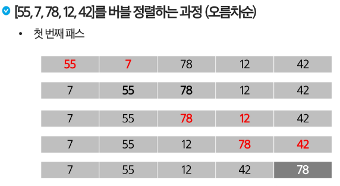
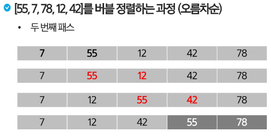
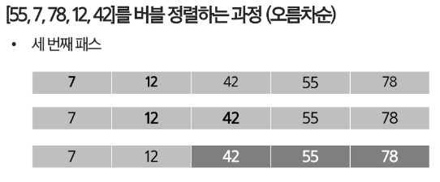
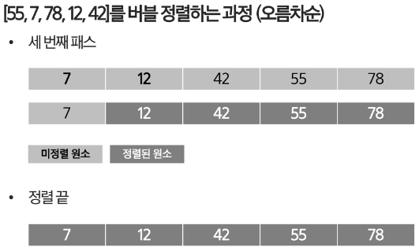

# 정렬 소개
- 2개 이상의 자료를 특정 기준에 의해 작은 값부터 큰값(오름차순:ascending), 혹은 그 반대의 순서대로(내림차순:descending) 재배열하는 것
## 대표적인 정렬 방식
- 버블 정렬(Bubble Sort)
- 선택 정렬(Selection Sort)
- 삽입 정렬(Insertion Sort)
- 카운팅 정렬(Counting Sort)
- 퀵 정렬(Quick Sort)
- 병합 정렬(Merge Sort)

## 버블 정렬(Bubble Sort)
- 첫번째 원소부터 인접한 원소끼리 계속 자리를 교환하면서 맨 마지막 자리까지 이동한다.
- 한 단계가 끝나면 가장  큰 원소가 마지막 자리로 정렬된다.
- 교환하며 자리를 이동하는 모습이 물 위에 올라오는 거품 모양과 같다고 하여 버블 정렬이라고 한다.
- 시간복잡도 : O(n^2)





### 버블 정렬 구현 코드
```python
def bubble_sort(arr):
    n = len(arr)

    for i in range(n):
        for j in range(0, n - i - 1):
            if arr[j] > arr[j + 1]:
                arr[j], arr[j + 1] = arr[j + 1], arr[j]
```
### 간단하고 이해하기 쉬워서 기초 정렬 알고리즘의 개념과 원리를 이해하는데 유용
- 최악 시간복잡도 : O(n^2)
- 최선 시간복잡도 : Ω(n)
- 안정성: O
- 적응성: O
- 제자리 정렬 : O
---
