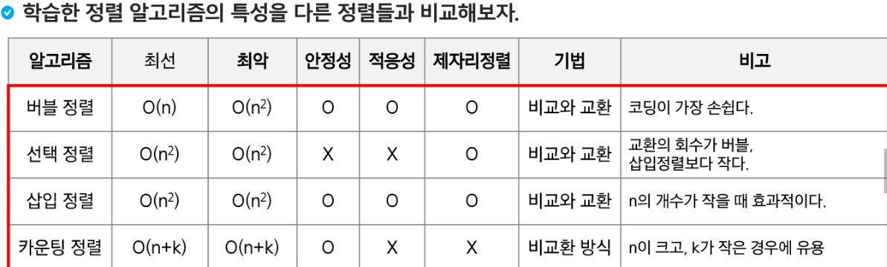

## 카운팅 정렬

- 항목들의 순서를 결정하기 위해 집합에 각 항목이 몇 개씩 있는지 세는 작업을 하여, 선형 시간에 정렬하는 효율적인 알고리즘
- 제한 사항
  - 정수나 정수로 표현할 수 있는 자료에 대해서만 적용 가능 : 각 항목의 발생회수를 기록하기 위해, 정수 항목으로 인덱스 되는 카운트들의 배열을 사용하기 때문이다.
  - 카운트들을 위한 충분한 공간을 할당하려면 집합 내의 가장 큰 정수를 알아야 한다.
- 시간 복잡도
  - O(n+k) : n은 리스트 길이, k는 정수의 최댓값

```python
def counting_sort(arr, max_value):
    n = len(arr)
    # 1. 최댓값 찾기 (max_value를 파라미터로 제공하고 있음)
    # 2. 최대값으로 배열 초기화하기 (최대값만큼 공간을 확보해야한다. -> index error 안날려고)
    count_arr = [0] * (max_value + 1) # 0개수에요. 초기에는 일단 0으로 초기화

    # 3. 각 요소가 몇 번 나왔는지 확인하기
    # 주어진 arr를 순회하면서, 개수를 센다. 해당 값을 인덱스로 활용해서 바로 값 추가한다.

    for num in arr:
        # 해당 값을 인덱스로 활용하고, 이미 0으로 초기화되어 있기 때문에 +1
        count_arr[num] += 1

    # 4. 안정성을 지키기 위해 누적합 배열을 만들어보자 ( 누적합 배열 : 해당 값이 들어갈 수 있는 범위)

    for i in range(1, k + 1):
        # 이전 값을 누적해서 스스로를 갱신한다.
        # 이전 값은 이미 이전 값들을 누적한 상태이므로 가능한 로직
        count_arr[i] += count_arr[i - 1]

    # 결과를 저장하기 위한 결과 배열
    result = [0] * n

    # 5. 주어진 배열을 거꾸로 순회하면서, 누적합 배열의 값을 이용해 값을 넣는다.
    for i in range(n - 1, -1, -1): # 역으로 순회
        val = arr[i]

        # count_arr[val] -> 값을 인덱스로 활용해서 들어가야 할 위치를 찾는다..
        # count_arr[val] - 1 -> 찾은 위치에서 1을 빼준다.
        # 이값을 다시 index로 활용해서 result에 val 값을 넣어준다.
        result[count_arr[val] - 1] = val

        count_arr[val] -= 1 # 이제 한 공안을 차지했기 때문에 1을 빼준다.

    return result
```

### 정수/정수표현이 가능한 경우에만 가능하고, N이크고,K가 작은경우에 유용

- 최선,최악 시간복잡도: O(n+k)
- 안정성 : o
- 적응성 : x
- 제자리 정렬 : x

---

# 0805 정렬 비교


