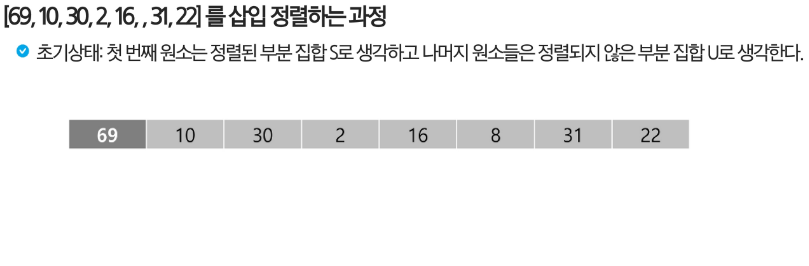
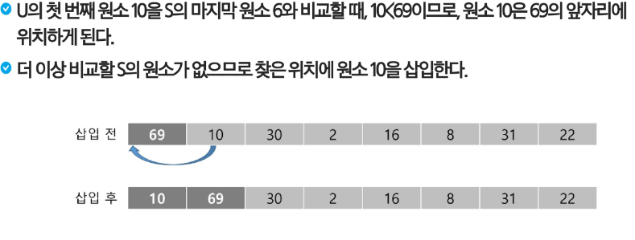
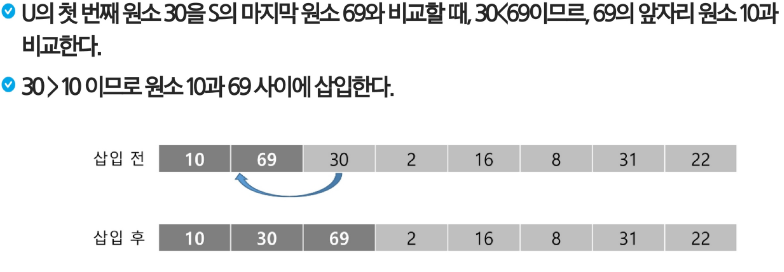
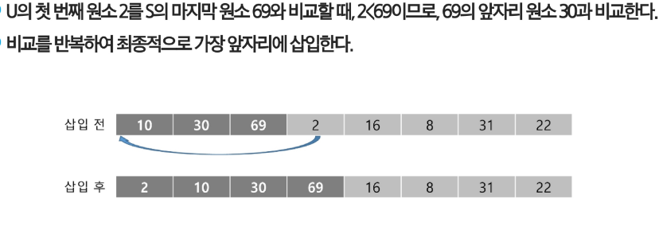
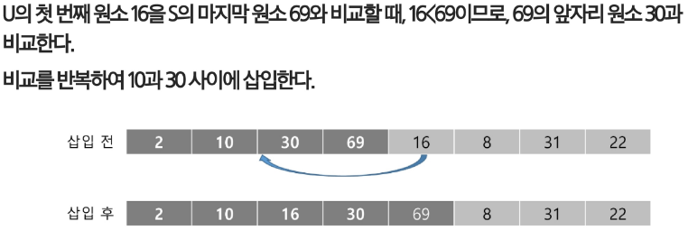
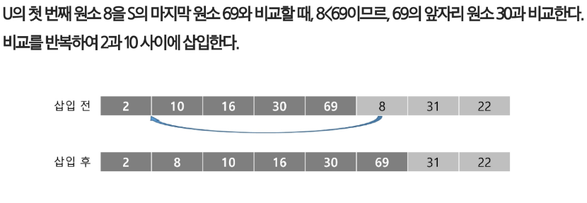
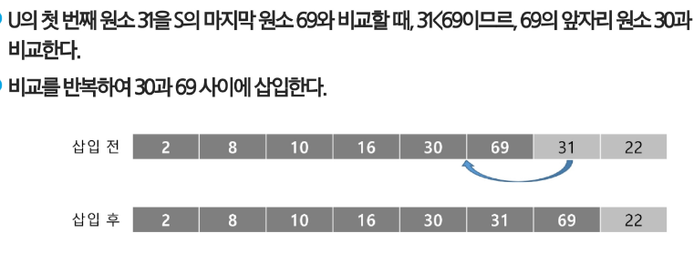
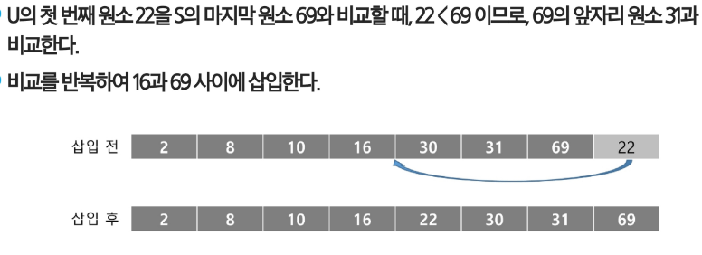

## 삽입 정렬
### 정렬 과정
1. 정렬할 자료를 두개의 부분집합 S와 U로 가정
    - 부분집합 s: 정렬된 앞부분의 원소들
    - 부분집합 U: 아직 정렬되지 않은 나머지 원소들
2. 정렬되지 않은 부분집합 U의 원소를 하나씩 꺼내서 이미 정렬 되어있는 부분집합 S의 마지막 원소부터 비교하면서 위치를 찾아 삽입한다.
3. 삽입 정렬을 반복하면서 부분집합 S의 원소는 하나씩 늘리고 부분집합 U의 원소는 하나씩 감소하게 된다. 부분집합 U가 공집합이 되면 삽입정렬이 완성된다.
- 시간 복잡도 : O(n^2)
---








### 삽입 정렬 구현 코드
```python
def insertion_sort(arr):
    n = len(arr)
    # 첫 번쨰 요소는 이미 정렬 됐다고 치자!
    # 두 번째 요소부터 미정렬이라고 치자!
    # 미정렬에 있는 요소를 정렬된 요소의 적합한 장소에 넣자
    for i in range(1,n): # 미정렬된 요소들을 순회하면서 정렬된 요소들의 적합한 장소 찾기
        # 현재 idx 요소로부터 왼쪽부터 이동하면서 비교를 시작한다.
        for j in range(i, 0, -1):
            if arr[j-1] > arr[j]: # 왼쪽 요소가 현재 요소보다 큰 경우에는 위치를 바꾼다.
                arr[j-1], arr[j] = arr[j], arr[j-1] # 서로를 위치를 교환하면서 이동한다.
            else: # 왼쪽 요소가 현재 요소보다 작거나 같은 경우.. 즉, 여기는 내 위치다.
                break
```
### 대부분 정렬된 경우이거나 작은 데이터 셋에 효율적
- 최악 시간복잡도: O(n^2)
- 최선 시간복잡도: Ω(n)
- 안정성: o
- 적응성: o
- 제자리 정렬: o
