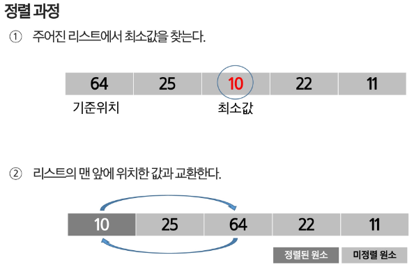
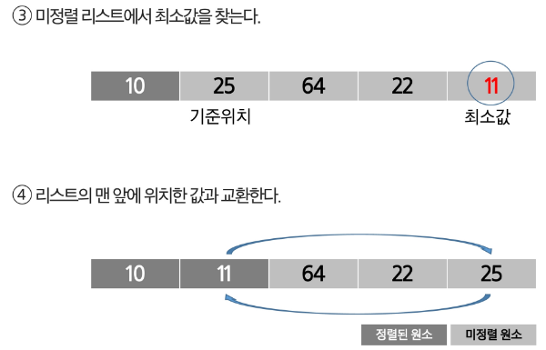
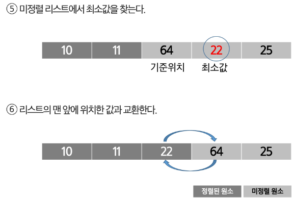
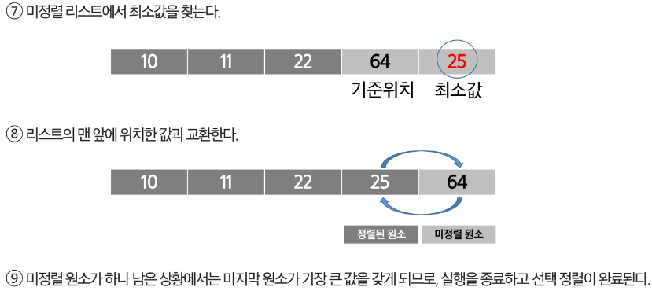

## 선택 정렬
- 주어진 자료들 중 가장 작은 값의 원소부터 차례대로 선택하여 위치를 교환하는 방식
### 정렬 과정
- 주어진 리스트 중에서 최소값을 찾는다.
- 그 값을 리스트의 맨 앞에 위치한 값과 교환한다.
- 맨 처음 위치를 제외한 나머지 리스트를 대상으로 위의 과정을 반복한다.
- 시간 복잡도 : O(n^2)




### 구현 코드
```python
def selection_sort(arr):
    n = len(arr)

    for i in ragne(n - 1):
        min_idx = i

        for j in range(i + 1, n):
            # 현재까지의 최소값보다 작은 값이 발견되면
            # 최소값 인덱스를 갱신한다.
            if arr[j] < arr[min_idx]:
                min_idx = j
            # for문이 끝났다는건,, 끝까지 돌아서 최소값을 찾았따는 의미
        
        arr[i],arr[min_idx] = arr[min_idx], arr[i]
```
### 간단하고 이해하기 쉬워서 기초 정렬 알고리즘의 개념과 원리를 이해하는데 유용
- 최악/최선 시간 복잡도: O(n^2)
- 안정성: x
- 적응성: x
- 제자리 정렬: o
