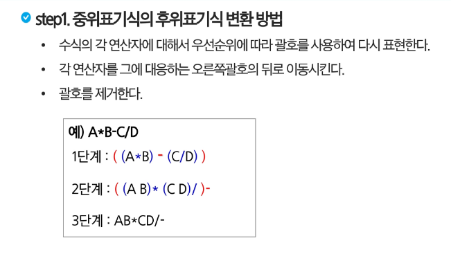

# 전 내용 복습
- 선형 자료구조 (순서 O , 1:1)
- 후입 선출 (Last In First Out,LIFO)
- Top 포인터(항상 맨 위 요소를 가리킴) -> 마지막에 원소를 쉽게 접근
- push (맨위 삽입, 꽉 찼는지 확인, top == 크기 -1 )
- pop  (맨뒤 추출, 비어있는지 확인, top == -1)
- 괄호검사 
    - 여는 괄호와 닫힌 괄호가 같을 것
    - 항상 여는 괄호가 먼저 
    - 짝이 맞을 것
    1) 여는 괄호 -> stack 삽입
    2) 닫힌 괄호 -> stack pop-> 비교
    3) 꺼낼 때 -> 비어있으면 -1
    4) 다하고, 남아있으면 -1
---
# 중위/후위 표기법
- 피연산자 -> 연산의 대상
- 후위표기법 -> 연산 뒤
- 피연산자는 무조건 연산자 앞
## step1 중위표기식의 후위 표기식 변환 방법
- 수식의 각 연산자에 대해서 우선수위에 따라 괄호를 사용하여 다시 표현한다.
- 각 연산자를 그에 대응하는 오른쪽괄호의 뒤로 이동시킨다.
- 괄호를 제거한다.

## step1 중위 표기법에서 후위 표기법으로의 변환 알고리즘(스택이용)
1. 입력 받은 중위 표기식에서 토큰을 하나씩 읽는다.
2. 토큰이 피연산자이면 토큰을 출력한다
3. 토큰이 연산자(괄호포함)일 때,
    1. 우선순위 : 토큰 > 스택의 top에 저장되어 있는 연산자
        - 스택에 push
    2. 우선순위 : 토큰 <= 스택의 top에 저장되어 있는 연산자
        - 스택 top의 연산자의 우선순위가 토큰의 우선순위보다 작을 때까지 스택에서 pop한 후 토큰의 연산자를 push
    3. 만약 top에 연산자가 없으면 push한다.
4. 토큰이 닫는 괄호 ')'이면 스택 top에 여는 괄호 '('가 올 때까지 스택에 pop 연산을 수행하고 pop한 연산자를 출력한다.
    - 여는 괄호를 만나면 pop만 하고 출력하지는 않는다.
5. 중위 표기식에 더 읽을 것이 없다면 중지하고, 더 읽을 것이 있다면 1부터 다시 반복한다.
6. 스택에 남아 있는 연산자를 모두 pop하여 출력한다.
    - 스택 밖의 왼쪽 괄호는 우선 순위가 가장 높으며, 스택 안의 왼쪽 괄호는 우선 순위가 가장 낮다.

## step2 후위 표기법의 수식을 스택을 이용하여 계산
1. 피연산자를 만나면 스택에 push한다.
2. 연산자를 만나면 필요한 만큼의 피연산자를 스택에서 pop하여 연산하고, 연산결과를 다시 스택에 push한다.
3. 수식이 끝나면, 마지막으로 스택을 pop하여 출력한다.