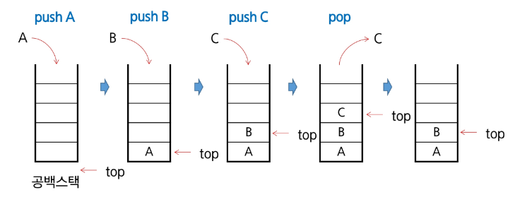

# Stack
- 물건을 쌓아 올리듯 자료를 쌓아 올린 형태의 자료구조이다.
- 스택에 저장된 자료는 선형 구조를 갖는다.
    - 선형구조 : 자료 가느이 관계가 1대1의 관계를 갖는다.
    - 비선형구조 : 자료 간의 관계가 1대N의 관계를 갖는다(예:트리)
- 스택에 자료를 삽입하거나 스택에서 자료를 꺼낼 수 있다.
- 뒤로 가기나 함수 호출에서 사용되는 구조이다.
- **후입선출 구조 (LIFO, Last-in First-Out)**
    - 마지막에 삽입한 자료를 가장 먼저 꺼낸다.
    - 예) 스택에 1,2,3 순으로 자료를 삽입하면 꺼낼 땐 3,2,1순으로 꺼낼 수 있다.
---
## 스택의 주요 연산
- Push 
    - (삽입)저장소에 자료를 저장한다.
- Pop
    - (삭제)저장소에서 자료를 꺼낸다.
    - 꺼낸 자료는 자료의 역순으로 꺼낸다.
- IsEmpty
    - 스택이 공백인지 확인한다.
- Peek
    - 스택의 top에 있는 자료를 반환한다.

## 스택의 삽입/삭제 과정
- 빈 스택에 원소 A,B,C를 차례로 삽입 후 한번 삭제하는 연산과정

## 스택 구현 - push(1/2)
- 메소드를 통한 구현
- append 메소드를 통해 리스트의 마지막에 데이터를 삽입

## 스택 구현 - push(2/2)
- 클래스를 이용해서 구조체를 정의하고, top포인터를 활용해서 구현

## 스택 구현 - pop(1/2)
- 메소드를 통한 구현
- pop메소드를 통해 리스트의 마지막에 데이터를 추출

## 스택 구현 - pop(2/2)
- 클래스를 이용해서 구조체를 정의하고, top포인터를 활용해서 구현

## 스택 구현 - IsEmpty

## 스택 구현 - Peek
