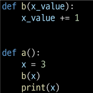
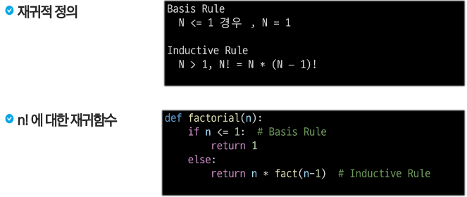
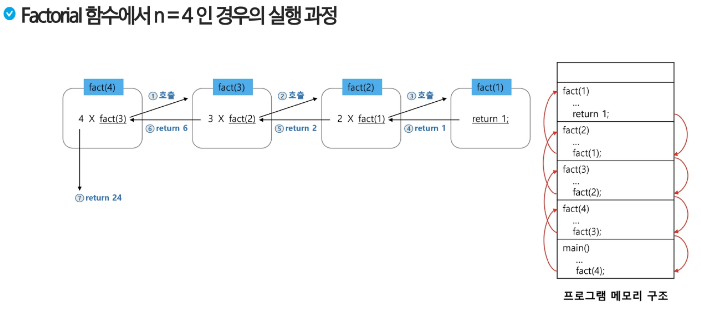
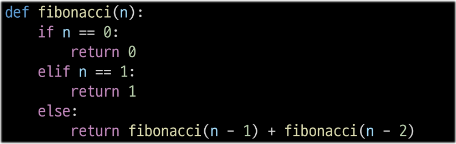

# 반복과 재귀
- 반복과 재귀는 유사한 작업을 수행할 수 있다.
- 반복은 수행하는 작업이 완료될때까지 반복
- 재귀는 주어진 문제의 해를 구하기 위해 동일하면서 더 작은 문제의 해를 이용하는 방법

## 재귀함수
- 함수 내부에서 직접 혹은 간접적으로 자기 자신을 호출하는 함수
- 일반적으로 재귀적 정의를 이용해서 재귀 함수를 구현한다.
- 따라서, 기본부분(basis part)과 유도 부분(inductive part)으로 구성된다.
- 재귀적 프로그램을 작성하는 것은 반복 구조에 비해 간결하고 이해하기 쉽다.
    - 그러나, 재귀에 대해 익숙하지 않은 개발자들은 재귀적 프로그램이 어렵다 느낌
- 함수 호출은 프로그램 메모리 구조에서 **스택**을 사용
- 재귀 호출은 반복적인 스택의 사용을 의미함. **메모리 및 속도에서 성능저하** 발생.

## 재귀 함수 연습 전 알아야하는 함수의 특징 - (1/2)
- A에서 B에 해당하는 함수를 호출할 때, immutable(int,str,tuple) 타입의 객체를 인자로 전달하면 값만 복사 (Pass by Value)
- mutable(list,dict,set)타입을 건네는 경우는 원본 객체도 함께 변경된다. (Pass by reference)
 

## 재귀 함수 연습 전 알아야하는 함수의 특징 - (2/2)
- 함수가 끝나면 Main으로 돌아오는 것이 아니라 **해당 함수를 호출했던 곳으로 돌아옴**
---
## 팩토리얼
- n!  :  1부터 n까지의 모든 자연수를 곱하여 구하는 연산

## 피보나치 수열
- 이전의 두 수 합을 다음 항으로 하는 수열
    - 0,1,1,2,3,5,8,13,...
- 위의 정의로부터 피보나치 수열의 i 번째 항을 반환하는 함수를 재귀함수로 구현할 수 있다.
### 재귀 함수를 이용한 피보나치 수 알고리즘 코드
