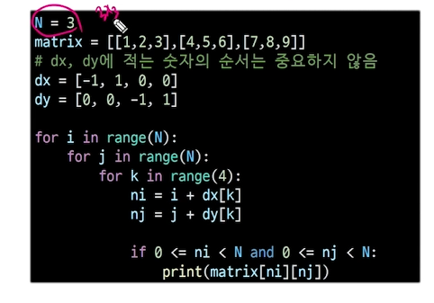

# 델타 탐색 (2차원배열과 동일하게 매우 중요)

### 2차 리스트의 한 좌표에서 4방향의 인접요소를 탐색

# 인덱스(i,j)인 칸의 상하좌우칸(ni,nj)

```
# !! 축개념으로 들어가면 매우 어려움 !!
# 방향 별로 더할 값
# 우, 하, 좌, 상
dx = [0,1,0,-1]
dy = [1,0,-1,0]

#(i,j)를 기준으로 상,하,좌,우를 탐색하는 방법
i,j = 1,1
for k in range(4):
    ni = i + dx[k]
    nj = j + dy[k]
```



- if 0 <= ni < N and 0 <= nj < N:
- 탐색해야하는 부분에서만 작동되게 조건을 걸어줘야함.
