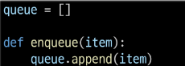
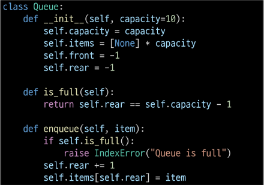
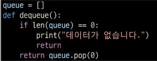
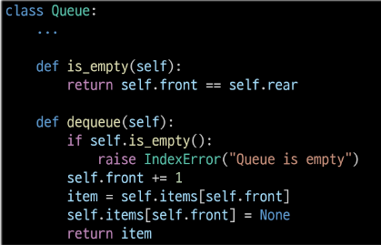
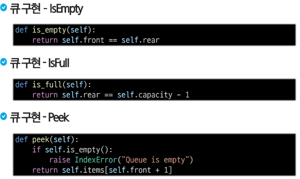

# 큐(queue)
- 스택과 마찬가지로 삽입과 삭제의 위치가 제한적인 자료구조
    - 큐의 **뒤에서는 삽입**만 하고, 큐의 **앞에서는 삭제**만 이루어지는 구조
- **선입선출(FIFO, FIrest In Firest Out)**

## 큐의 주요 연산
- EnQueue
    - 큐의 뒤쪽에 원소를 삽입하는 연산
- Dequeue
    - 큐의 앞쪽에서 원소를 삭제하고 반환하는 연산
- IsEmpty
    - 큐가 공백상태인 지를 확인하는 연산
- peek 
    - 큐의 앞쪽에서 원소를 삭제 없이 변환하는 연산

## 큐 구현 - enqueue(1/2)
- 메소드를 통한 구현
- append 메소드를 통해 리스트의 마지막에 데이터를 삽입

## 큐 구현 - enqueue(2/2)
- 클래스를 이용해서 구조체를 정의하고, front,rear 포인터를 활용해서 구현

---
## 큐 구현 - dequeue (1/2)
- 메소드를 통한 구현
- pop 메소드를 통해 리스트의 처음 데이터를 추출

## 큐 구현 - dequeue (2/2)
- 클래스를 이용해서 구조체를 정의하고, front,rear 포인터를 활용해서 구현

## 큐 구현 나머지
