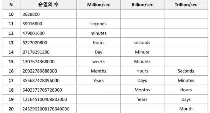

# 순열(Permutation) - (1/2)
- 서로 다른 것 중 몇 개를 뽑아서 순서대로 나열하는 것
- 서로 다른 n개 중 r개를 택하는 순열은 아래와 같이 표현한다.
    - nPr
- 그리고 nPr은 다음과 같은 식이 성립한다.
    - nPr = n * (n-1) * (n-2) * ... * (n-r+1)
- nPn = n! 이라고 표기하며 **Factorial**이라 부른다.
    - n! = n * (n-1) * (n-2) * ... * 2 * 1
- 예) 여행지 A,B,C를 방문할 때 가능한 경로는 ?? 6가지

# 순열(Permutation) - (2/2) 
- 다수의 알고리즘 문제들은 순서화된 요소들의 집합에서 최선의 방법을 찾는 것과 관련 있다.
- N개의 요소들에 대해서 n! 개의 순열들이 존재한다.
    - 12! = 479,001,600
    - N>12인 경우, 시간 복잡도는 폭발적으로 증가
    

## 구현 - 반복문
- {1,2,3}을 포함하는 모든 순열을 반복문으로 생성
```python
for i in range(1,4):
    for j in range(1,4):
        if j != i:
            for k in range(1,4):
                if k != i and k != j:
                    print(i,j,k)
```

## 구현 - 재귀
- {1,2,3}을 포함하는 모든 순열을 재귀 함수로 생성
```python
# selected: 선택된 값 목록
# remain: 선택되지 않고 남은 값 목록
def perm(selected, remain):
    if not remain:
        print(selected)
    else:
        for i in range(len(remain)):
            select_i = remain[i]
            remain_list = remain[:i] + remain[i+1:]
            perm(selected + [select_i], remain_list)
perm([],[1, 2, 3])
```

# 중복 순열
- 순서를 고려하여 여러 번 선택할 수 있게 나열하는 모든 가능한 방법
- 예) 비밀번호를 생성할 때, 각 자리의 문자는 중복될 수 있으며 순서를 고려해야 한다.
- 예) {1,2,3}
    - 원소를 1개 선택하는 경우 (3개)
        - {1},{2},{3}
    - 원소를 2개 선택하는 경우 (9개)
        - {1,1},{1,2},{1,3},{2,1},{2,2},{2,3},{3,1},{3,2},{3,3}
    - 원소를 3개 선택하는 경우 (27개)
        - {1,1,1},{1,1,2},{1,1,3},{1,2,1},...

# ltertools
- 반복(iteration)과 관련된 다양한 함수를 제공하는 파이썬 표준 라이브러리
- itertools 라이브러리를 활용해 다양한 순열과 조합을 구현할 수 있음
```python
import itertools
arr = [1,2,3]

print(tuple(intertools.permutations(arr))) # 순열
# ((1, 2, 3), (1, 3, 2), (2, 1, 3), (2, 3, 1), (3, 1, 2), (3, 2, 1))

print(tuple(itertools.product(arr, repeat=2))) # 중복 순열
# ((1, 1), (1, 2), (1, 3), (2, 1), (2, 2), (2, 3), (3, 1), (3, 2), (3, 3))
```