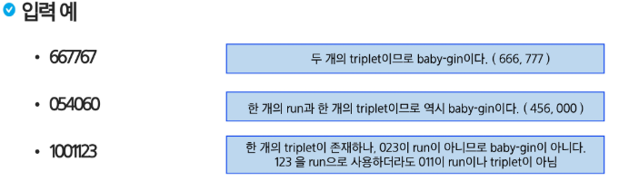

# 완전 탐색
- 설명
    - 0~9 사이의 숫자 카드에서 임의의 카드 6장을 뽑았을 때, 3장의 카드가 연속적인 번호를 갖는 경우를 run이라 하고, 3장의 카드가 동일한 번호를 갖는 경우를 triplet이라고 한다.
    - 그리고, 6장의 카드가 run과 triplet로만 구성된 경우를 baby-gin으로 부른다.
    - 6자리의 숫자를 입력 받아 baby-gin 여부를 판단하는 프로그램을 작성하라
    

## 6자리의 숫자를 입력 받아 어떻게 Baby-gin 여부를 찾을 것인가? - (1/2)
- 입력받은 숫자를 정렬한 후, 앞 뒤 3자리씩 끊어서 run 및 triplet을 확인하는 방법
- 예){6, 4, 4, 5, 4, 4}
    - 정렬하여 [4,4,4,4,5,6]을 얻어내면 쉽게 baby-gin을 확인할 수 있다.
- 예)[1,2,3,1,2,3]
    - 정렬하면 {1,1,2,2,3,3}로서, 오히려 baby-gin 확인에 실패할 수 있다.
- 위의 예처럼, 탐욕 알고리즘적인 접근은 해답을 찾아내지 못하는 경우도 있으니 유의해야 한다.

## 6자리의 숫자를 입력 받아 어떻게 Baby-gin 여부를 찾을 것인가? - (2/2)
- 고려할 수 있는 모든 경우의 수 생성하기
- 6개의 숫자로 만들 수 있는 모든 숫자 나열(중복 포함)
- 예) 입력으로 {2,3,5,7,7,7}을 받았을 경우, 아래와 같이 순열을 생성할 수 있다.

## 해답 테스트하기
- 앞의 3자리와 뒤의 3자리를 잘라, run와 triplet 여부를 테스트하고 최종적으로 baby-gin을 판단한다.
---

# 대표적인 문제 해결 기법
- **완전탐색 (Brute-Force)**
    - 답이 될 수 있는 모든 경우를 시도해보는 알고리즘
- 탐욕 알고리즘(Greedy)
    - 각 순간에 최적이라고 생각되는 것을 선택해 나가는 방식
- 분할 정복(Divide and Conquer)
    - 복잡한 문제를 더 작은 하위 문제들로 나누어 해결하는 알고리즘
- 다이나믹 프로그래밍 (Dynamic Programming, DP)
    - 현재에서 가장 보이는것을 선택하는 것이 아니라, 과거의 데이터를 이용하여 현재의 데이터를 만들어내는 방식