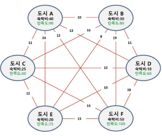
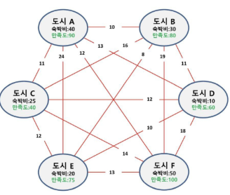
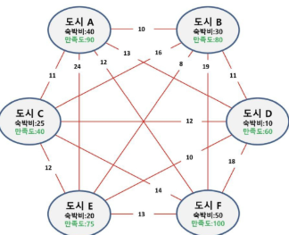

# 완전탐색
- 문제의 해법으로 생각할 수 있는 모든 경우의 수를 나열해보고 확인하는 기법
- Brute-force 혹은 generate-and-test 기법이라고도 불린다.
    - "Just-di-it"
- 대부분 문제에 적용이 가능하다.
- 상대적으로 빠른 시간에 문제 해결(알고리즘 설계)을 할 수 있다.
- 일반적으로 경우의 수가 작다면 유용하다.

# 완전탐색으로 시작하기
- 모든 경우의 수를 생성하고 테스트하기 때문에 수행 속도는 느리지만, 해답을 찾아내지 못할 확률이 낮다.
- 전형적으로 순열(permutation), 조합(combination), 부분집합(subset)과 같은 조합적 문제들과 연관된다.
- 검정 등에서 주어진 문제를 풀 때, **우선 완전 검색으로 접근하여 해답을 도출한 후, 성능 개선을 위해 다른 알고리즘을 사용하고 해답을 확인하는 것이 바람직**하다.

## 여행 계획 - (1/3)
- 출발, 도착 도시를 선택하면 모든 도시를 여행하는 코스를 알려드립니다.
- 모든 도시를 여행하는 코스를 정할 때 어떤 코스가 경비가 가장 적게 들까?

## 여행 계획 - (2/3)
- 3개의 도시를 선택하면 숙박지를 지원해 드립니다.
- 여행자는 어느 도시를 선택했을 때 가장 이득일까?

## 여행 계획 - (3/3)
- 여행 경비를 넘지 않으며 최대 만족도를 갖도록 선택하려면 어떤 코스가 좋을까?
- 여행경비는 70만원이 있으며, 이동 경로는 고려하지 않는다.

# 완전 검색과 조합적 문제
- 많은 종류의 문제들이 특정 조건을 만족하는 경우나 요소를 찾는 것이다.
- 또한, 이들은 전형적으로 **순열(permutation)**, 조합(combination) 그리고 부분집합(subset)과 같은 조합적 문제들과 연관된다.