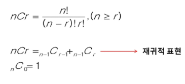

# 조합(Combination)

- 순서를 고려하지 않고 아이템을 선택하는 방법
- 예) 1부터 45까지의 숫자 중 6개를 선택해서 당첨 -> 약 815만
- 서로 다른 n개의 원소 중 r개를 **순서 없이** 골라낸 것!
- 조합의 수식
  

### 구현: 반복문

- {1,2,3,4} 중 원소 3개를 포함하는 모든 조합을 반복문으로 생성

```python
for i in range(1, 5):
    for j in range(i+1, 5):
        for k in range(j+1, 5):
            print(i,j,k)
```

### 구현: 재귀

- {1,2,3,4} 중 원소 3개를 포함하는 모든 조합을 재귀함수로 생성

```python
def comb(arr,n):
    result = []
    if n == 1:
        return [[i] for i in arr]

    for i in range(len(arr)):
        elem = arr[i]
        for rest in comb(arr[i + 1:], n - 1):
            result.append([elem] + rest)
    return result
print(comb([1,2,3,4], 3))
```

## 중복 조합

- 순서를 고려하지 않고 여러 번 선택할 수 있게 나열하는 모든 가능한 방법
- 예) 아이스크림 가게에서 여러 가지 맛 중에서 원하는 맛을 선택하는 경우
- 예) {1,2,3}
  - 원소를 1개 선택하는 경우 (3개)
    - {1},{2},{3}
  - 원소를 2개 선택하는 경우 (6개)
    - {1,1},{1,2},{1,3},~~{2,1}~~,{2,2},{2,3},~~{3,1},{3,2}~~,{3,3}
  - 원소를 3개 선택하는 경우 (10개)
    - {1,1,1},{1,1,2},{1,1,3},~~{1,2,1}...~~

## Itertools

- 반복(iteration)과 관련된 다양한 함수를 제공하는 파이썬 라이브러리
- itertools 라이브러리를 활용해 다양한 순열과 조합을 구현할 수 있음

```python
import itertools
arr = [1, 2, 3]

print(tuple(intertools.permutations(arr))) # 순열
# ((1, 2, 3), (1, 3, 2), (2, 1, 3), (2, 3, 1), (3, 1, 2), (3, 2, 1))

print(tuple(itertools.product(arr, repeat=2))) # 중복 순열
# ((1, 1), (1, 2), (1, 3), (2, 1), (2, 2), (2, 3), (3, 1), (3, 2), (3, 3))

print(tuple(itertools.combinations(arr, 2))) # 조합
# ((1, 2), (1, 3), (2, 3))

print(tuple(itertools.combinations_with_replacement(arr, 2))) # 중복조합
# ((1, 1), (1, 2), (1, 3), (2, 2), (2, 3), (3, 3))
```

## 재귀를 활용한 다양한 구현

- 재귀로 구현한 조합을 조금만 응용하면 다양한 순열과 조합을 구현할 수 있다.

```python
def comb(arr,n):
    result = [] # 조합을 저장할 리스트
    if n == 1:
        return [[i] for i in arr]

    for i in range(len(arr)):
        elem = arr[i]

        for rest in comb(arr[i + 1:]. n - 1) # 조합
        # for rest in comb(arr[:i] + arr[i+1:], n - 1) # 순열
        # for rest in comb(arr, n - 1) # 중복순열
        # for rest in comb(arr[i:], n - 1) # 중복조합
            result.append([elem] + rest)

    return result
```
