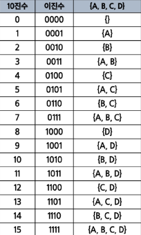

# 부분 집합(Power Set)

- 집합에 포함된 원소들을 선택하는 것이다.
- 많은 중요 알고리즘들이 원소들의 그룹에서 최적의 부분 집합을 찾는데 사용된다.
  - 예) 배낭 짐싸기(knapsack)

# 부분 집하의 수

- N개의 원소를 포함한 집합에서 공집합을 포함한 부분집합의 개수는 2\*\*n개이다.
- 각 원소를 부분집합에 포함하거나 포함하지 않는 2가지 경우를 모든 원소에 적용한 것과 같다.
- {1,2,3,4}
- 2 _ 2 _ 2 \* 2 = 16가지

# 구현: 반복문

- {1,2,3}집합의 모든 부분 집합을 반복문으로 생성

```python
selected = [0] * 3
for i in range(2): # 각 자릿수
    selected[0] = i
    for j in range(2):  # 각 자릿수
        selected[1] = j
        for m in range(2):  # 각 자릿수
            selected[2] = m
            subset = []     # 부분집합을 저장하는 배열
            for n in range(3):    # 선택을 했는지 확인하는 for문
                if selected[n] == 1:
                    subset.append(n+1)  # 선택을 했으면, 부분집합 저장하는 배열에 추가
            print(subset)
```

# 구현: 재귀

- {1,2,3}집합의 모든 부분 집합을 재귀로 생성
  - 각 원소를 부분집합에 포함/비포함의 형태로 재귀적 구현
  - 밑 코드는 외울정도로 중요함

```python
def generate_subset(depth,included):
    if depth == len(input_list):
        cnt_subset = [input_list[i] for i in range(len(input_list)) if included[i]]
        subset.append(cnt_subset)
        return

    included[depth] = False
    generate_subset(depth + 1, included)

    included[depth] = True
    generate_subset(depth + 1, included)

input_list = [1,2,3]
subsets = []
init_included = [False] * len(input_list)
generate_subset(0, init_included)
print(subsets)
```

# 구현: 바이너리 카운팅(Binary Counting)

- 부분집합을 생성하기 가장 자연스러운 방법이다.
- 원소 수에 해당하는 N개의 비트열을 이용한다.
- n번 비트값이 1이면 n번 원소가 포함되었음을 의미한다.
  
- {1,2,3}집합의 모든 부분 집합을 바이너리 카운팅으로 생성

```python
arr = [1,2,3]
n = len(arr)
subset_cnt = 2 ** n

subsets = []
for i in range(subset_cnt):
    subset = []
    for j in range(n):
        if i & (1 << j):
            subset.append(arr[j])
    subsets.append(subset)

print(subsets)
```
