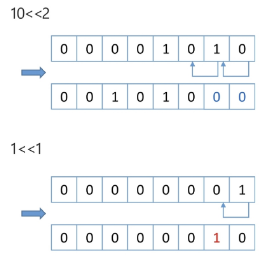
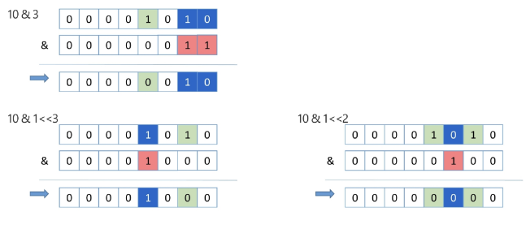
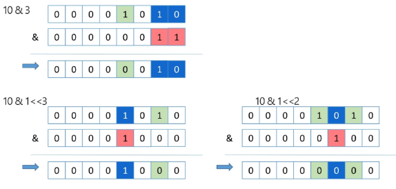
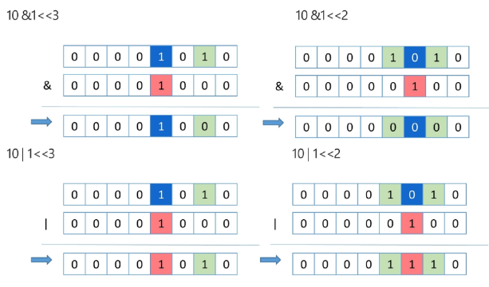

# 비트연산
- 컴퓨터의 CPU는 0과 1로 다루어 동작되며, 내부적으로 비트 연산을 사용하여 덧셈, 뺄셈, 곱셈 등을 계산
- cpu가 직접 지원하는 가장 기본적인 연산으로 매우 빠르고 효율적으로 동작

# 비트연산 챕터의 목적
- 사람이 사용하는 사칙연산이 아닌 컴퓨터가 사용하는 연산인 **비트연산**을 이해해본다
- 더 나아가, **프로그래밍에서 비트연산을 활용한 코딩 방법을 익혀본다**

# 비트 연산자
- & : 비트단위로 AND 연산을 한다. ex) num1&num2
- | : 비트단위로 OR 연산을 한다. ex) num1 | num2
- ^ : 비트단위로 XOR 연산을 한다(같으면 0, 다르면 1) ex) num1^num2
- ~ : 단항 연산자로서 피연산자의 모든 비트를 반전시킨다. ex) ~num
- << : 피연산자의 비트 열을 왼쪽으로 이동시킨다. ex) num<<2
- '>>' : 피연산자의 비트 열을 오른쪽으로 이동시킨다. ex) num>>2

# << 연산자
- value << n
- value를 n 비트만큼 왼쪽으로 shift
- 왼쪽으로 밀어내고 남는 오른쪽 자리는 0으로 채움

# & 연산자
- value1 & value2
- 각 비트열을 비교하여 두 비트 모두 1이면 1, 아니면 0으로 처리

# | 연산자
- value1 | value2
- 각 비트열을 비교하여 두 비트 모두 0이면 0, 아니면 1으로 처리

# & 와 | 연산자 비교
