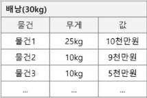

# Greedy (탐욕) 알고리즘
- 최적해를 구하는데 사용되는 근시안적인 방법
- 최적화 문제란 가능한 해들 중에서 가장 좋은(최대 또는 최소) 해를 찾는 문제이다
- 일반적으로, 머리 속에 떠오르는 생각을 검증 없이 바로 구현하면 Greedy 접근이 된다
- 여러 경우 중 하나를 선택할 때마다 그 순간에 최적이라고 생각되는 것을 선택해 나가는 방식으로 진행하여 최종적인 해답에 도달한다
- 각 선택 지점에서 이루어지는 결정은 지역적으로는 최적이지만, 그 선택들을 계속 수집하여 최종적인 해답을 만들었다고 하여, **그것이 최적이라는 보장은 없다**
- 일단, 한번 선택된 것은 번복하지 않는다. 이런 특성 때문에 대부분의 탐욕 알고리즘은 단순하며, 또한 제한적인 문제들에 적용된다
---
# 활용1 : 동전 교환 문제

## 아래 조건에서 거스름돈을 최소한의 동전 수로 지불하는 문제를 다시 생각해보자.
- 물건 값: 1200원
- 받은 돈: 2000원
- 거스름돈: 800원
- 동전 종류: 500원, 100원, 50원, 10원
## 큰 동전부터 최대한 거슬러 주면 된다.
1. 거스름돈 800원 - 500원 1개 = 잔액 300원
2. 잔액 300원 - 100원 3개 = 0원
3. 총 3개의 동전 사용
## 이처럼, 좋아  보이는 값을 먼저 선택하는 것을 탐욕(Greedy)알고리즘이라고 한다.
---
## 동전 종류가 달라진 조건에서 최소한의 동전 수로 지불하는 문제를 다시 생각해보자.
- 물건 값: 1200원
- 받은 돈: 2000원
- 거스름돈: 800원
- 동전 종류: 500원,400원,100원,50원,10원
## 큰 동전부터 최대한 거슬러 주면 최적의 개수가 되지 않는다.
1. 거스름돈 800원 - 400원 2개 = 잔액 0원
2. 총 2개의 동전 사용
## 결국 각 동전의 가치가 그보다 작은 모든 동전의 배수여야 탐욕 알고리즘이 성립된다.
- 그리디 알고리즘은 복잡한 문제를 간단하게 풀 수도 있지만, 그게 옳은 지 증명하기는 어렵다
### 동전 교환 코드 구현
```python
def get_minimum_coins(coins, amount):
    result = {}
    coins.sort(reverse=True)

    for coin in coins:
        if amount >= coin:
            count = amount // coin
            amount -= count * coin
            result[coin] = count
    return result

coins = [10,50,100,500] # 동전 종류
amount = 800 # 거스름돈
result = get_minimum_coins(coins,amount)
for coin,count in result.items():
    print(f'{coin}원: {count}개')
```
---
# 활용1 : 배낭 짐싸기
- 도둑은 부자들의 값진 물건들을 훔치기 위해 보관 창고에 침입하였다.
- 도둑은 훔친 물건은 배낭에 담아 올 게획이다. 배낭은 담을수 있는 물건의 총 무게(W)가 정해져 있다.
- 창고에는 여러 개(n개)의 물건들이 있고 각각의 물건에는 무게와 값이 정해져 있다.
- 경비원들에게 발각되기 전에 배낭이 수용할 수 있는 무게를 초과하지 않으면서, 값이 최대가 되는 물건들을 담아야한다.

## 배낭 짐싸기(Knapsack) 문제의 정형적 정의

## 문제 정의

## Knapsack 의 대표적인 문제 유형
- 0-1 Knapsack
    - 배낭에 물건을 통째로 담아야 하는 문제
    - 물건을 쪼갤 수 없는 경우
- Fractional knapsack
    - 물건을 부분적으로 담는 것이 허용되는 문제
    - 물건을 쪼갤 수 있는 경우
## 0-1 Knapsack에 대한 완전 검색 방법
- 완전 검색으로 물건들의 집합 S에 대한 모든 부분 집합을 구한다.
- 부분집합의 총 무게가 W를 초과하는 집합들은 버리고, 나머지 짖ㅂ합에서 총 값이 가장 큰 집합을 선택할 수 있다.
- 물건의 개수가 증가하면 시간 복잡도가 지수적으로 증가한다.
    - 크기 n인 부분집합의 수 2**n

## 0-1 knapsack에 대한 탐욕적 방법 - (1/3)

- 값이 비싼 물건부터 채운다. 
- W = 30kg
- 탐욕적 방법의 결과
    - 물건1 -> 25kg, 10만원
- 최적해
    - 물건2,물건3 -> 20kg, 14만원
- 최적이 아니다.
## 0-1 knapsack에 대한 탐욕적 방법 - (2/3)

- 무게가 가벼운 물건부터 채운다.
- W = 30kg
- 탐욕적 방법의 결과
    - 물건2+물건3 -> 14만원
- 최적해
    - 물건1 -> 15만원
- 역시 최적해를 구할 수 없다.
## 0-1 knapsack에 대한 탐욕적 방법 - (3/3)

- 무게당 (예>kg당)값이 높은 순서로 물건을 채운다.
- W = 30kg
- 탐욕적 방법의 결과
    - 물건1,물건3 -> 190만원
- 최적해
    - 물건2,물건3 -> 200만원
- 역시 탐욕적 방법으로 최적해를 구하기 어렵다.
### 결국 이 문제는 DP로 해결해야한다
---
## Fractional Knapsack 문제

- 물건의 일부를 잘라서 담을 수 있다.
- 탐욕적인 방법
    - 물건1 5kg + 물건3 20kg + 물건2의 절반 5kg -> 30kg
    - 50만원 + 140만원 + 30만원 -> 220만원