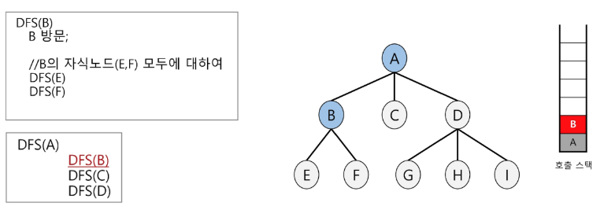
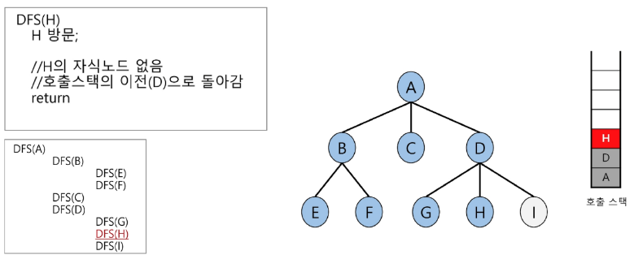

# 트리 탐색
- 루트 노드에서 출발하여 한 방향으로 갈 수 있는 경로가 있는 곳까지 **깊이 탐색**해 가다가 더 이상 갈 곳이 없게 되면, 가장 마지막에 만났던 갈림길 간선이 있는 노드로 되돌아와서 다른 방향의 노드로 탐색을 계속 반복하여 결국 모든 노드를 방문하는 순회 방법

- 가장 마지막에 만났던 갈림길의 노드로 되돌아가서 다시 깊이 우선 탐색을 반복해야 하므로 재귀적으로 구현하거나 **후입선출 구조의 스택**을 사용해서 구현

# DFS 알고리즘 

1. 루트노드 A를 시작으로 깊이 우선 탐색을 시작

2. 노드 B에서 깊이 우선 탐색을 처리

3. 노드 E에서 깊이 우선 탐색을 처리

4. 노드 F에서 깊이 우선 탐색을 처리

5. 노드 C에서 깊이 우선 탐색을 처리

6. 노드 D에서 깊이 우선 탐색을 처리

7. 노드 G에서 깊이 우선 탐색을 처리

8. 노드 H에서 깊이 우선 탐색을 처리

9. 노드 I에서 깊이 우선 탐색을 처리


```python
tree = {'A' : ['B','C','D'],
        'B' : ['E','F'],
        'D' : ['G', 'H', 'I']}

def dfs(tree, node):
    print(node)
    if node not in tree:
        return
    
    for child in tree[node]:
        def(tree,child)

dfs(tree, 'A')
```