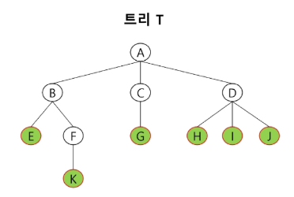
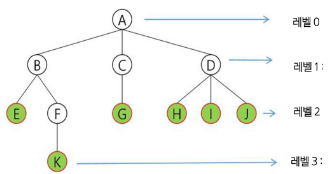
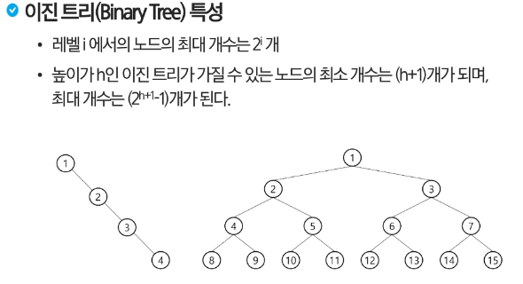
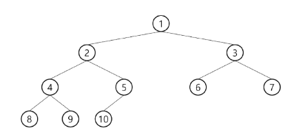
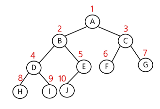
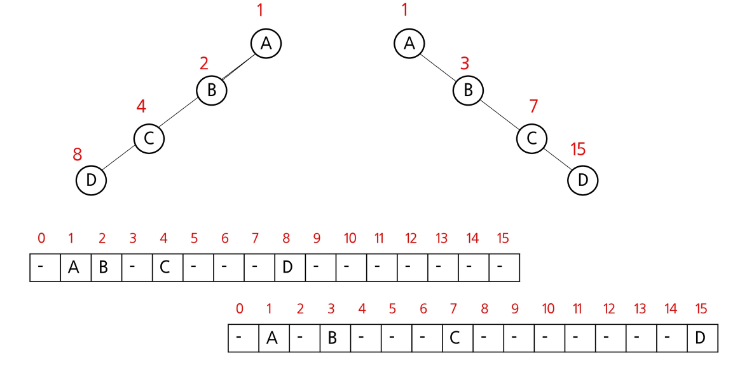
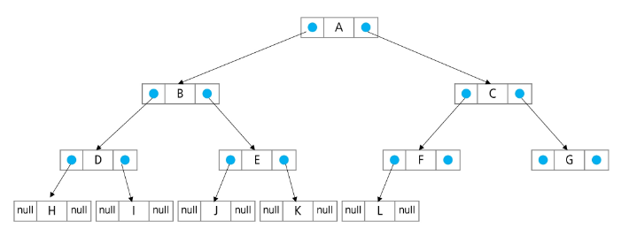

# 트리의 개념
- 비선형 구조
- 원소들 간에 1:n 관계를 가지는 자료구조
- 원소들 간에 계층관계를 가지는 계층형 자료구조
- 상위 원소에서 하위 원소로 내려가면서 확장되는 트리(나무)모양의 구조

# 한 개 이상의 노드로 이루어진 유한 집합이며 다음 조건을 만족한다.
- 노드 중 최상위 노드를 루트(root)라 한다.
- 나머지 노드들은 n(>=0)개의 분리 집합 T1,...,TN으로 분리될 수 있다.

# 이들 T1, ... , TN은 각각 하나의 트리가 되며(재귀적 정의) 루트의 부 트리(subtree)라 한다.

# 트리 용어
- 노드 (node)
    - 트리의 원소
    - A,B,C,D,E,F,G,H,I,J,K
- 간선(edge)
    - 노드와 노드를 연결하는 선
    - 부모 노드와 자식 노드를 연결
- 루트 노드(root node)
    - 트리의 시작 노드인 최상위 노드
    - 트리 T의 루트 노드 -A
- 형제 노드(sibling node)
    - 같은 부모 노드의 자식 노드들
    - B,C,D는 형제 노드
- 조상 노드(ancestor node)
    - 간선을 따라 루트 노드까지 이르는 경로에 있는 모든 노드들
    - K의 조상 노드: F,B,A
- 서브 트리(subtree)
    - 부모 노드와 연결된 간선을 끊었을 때 생성되는 트리
- 자손 노드(descendant node)
    - 서브 트리에 있는 하위 레벨의 노드들
    - B의 자손 노드 - E,F,K
- 차수(degree)
    - 노드에 연결된 자식노드 수
    - B의 차수=2, C의 차수 = 1
- 트리의 차수
    - 트리에 있는 노드의 차수 중에서 가장 큰 값
    - 트리 T의 차수 = 3
- 단말 노드(leaf node)
    - 차수가 0인 노드 즉, 자식 노드가 없는 노드

- 레벨
    - 루트에서 노드까지의 거리
    - 루트 노드의 레벨은 0, 자식 노드의 레벨은 부모 레벨 +1
- 높이
    - 루트 노드에서 가장 먼 리프 노드까지의 간선 수
    - 트리의 높이는 최대 레벨(트리T의 높이=3)


# 이진 트리(Binary Tree)
- 모든 노드들이 최대 2개의 서브 트리를 갖는 특별한 형태의 트리 (차수가 2인 트리)
- 각 노드가 자식 노드를 최대한 2개 까지만 가질 수 있는 트리
    - 왼쪽 자식 노드 (left child node)
    - 오른쪽 자식 노드 (right cild node)
- 이진 트리의 예


# 이진 트리(Binary Tree) 특성
- 레벨 i 에서의 노드의 최대 개수는 2**i 개
- 높이가 h인 이진 트리가 가질 수 있는 노드의 최소 개수는 (h+1)개가 되며, 최대 개수는 (2**h+1 -1 )개가 된다.


# 포화 이진 트리 (Perfect Binary Tree)
- 모든 레벨에 노드가 포화 상태로 차 있는 이진 트리
- 높이가 h일 때, 최대 노드 개수인(2**h+1  - 1)의 노드를 가진 이진 트리
    - 높이가 3일 때 2**3+1 -1 = 15개의 노드
- 루트를 1번으로 하여 2h+1 -1까지 정해진 위치에 대한 노드 번호를 가짐


# 완전 이진 트리 (Complete Binary Tree)
- 높이가 h이고 노드 수가 n일 때, (단, h+1 <= n < 2h+1 -1), 포화 이진 트리의 노드 번호 1번부터 n번까지 빈 자리가 없는 이진 트리
- 예) 노드가 10개인 완전 이진 트리


# 편향 이진 트리 (Skewed Binary Tree)
- 높이 h에 대한 최소 개수의 노드를 가지면서 한쪽 방향의 자식 노드 만을 가진 이진 트리
    - 왼쪽 편향 이진 트리
    - 오른쪽 편향 이진 트리


# 이진 트리 표현 : 리스트
## 리스트를 이요한 이진 트리의 표현
- 이진 트리에 각 노드 번호를 다음과 같이 부여
- 루트의 번호를 1로 함
- 레벨 n에 있는 노드에 대하여 왼쪽부터 오른쪽으로 2의 n제곱(2** n ) 부터 2**n+1 -1까지 번호를 차례로 부여


## 리스트를 이요한 이진 트리의 표현
- 노드 번호가 i일 때
    - 부모 노드 번호 : i/2
    - 왼쪽/오른쪽 자식 노드 번호: 2 * i, 2* i +1
    - 레벨 n의 노드 번호 시작 번호는? 2**n


# 리스트를 이요한 이진 트리의 표현
- 노드 번호를 리스트의 인덱스로 사용
- 높이가 h인 이진 트리를 위한 배열의 크기
    - 레벨 i의 최대 노드 수는 ? 2**i
    - 따라서 모든 노드의 수는 ? 
    - 리스트의 크기는 ? 2**h+1



# 리스트를 이요한 이진 트리의 표현


# 리스트를 이용한 이진 트리 구현
```python
class BinaryTree:
    def __init__(self):
        self.tree = [None,'A','B','C','D','E','F','G','H','I','J','K','L']
    
    def insert(self, value):
        self.tree.append(value)
    
    def get_node(self, index):
        if index < len(self.tree):
            return self.tree[index]
        return None
    
    def set_node(self, index, value):
        while len(self.tree) <= index:
            self.tree.append(None)
        self.tree[index] = value
    
    def get_left_child(self, index):
        left_index = 2 * index
        if left_index < len(self.tree):
            return self.tree[left_index]
        return None
    
    def get_right_child(self,index):
        right_index = 2 * index + 1
        if right_index < len(self.tree):
            return self.tree[right_index]
        return None
    
    def get_parent(self,index):
        if index == 0:
            return None
        parent_index = index // 2
        return self.tree[parent_index]
```

#  리스트를 이용한 이진 트리의 표현의 단점
- 편향 이진 트리의 경우에 사용하지 않는 리스트 원소에 대한 메모리 공간 낭비 발생
- 트리의 중간에 새로운 노드를 삽입하거나 기존의 노드를 삭제할 경우 리스트의 크기 변경이 어려워 비효율적

# 연결 리스트를 이용한 이진 트리의 표현
- 리스트를 이용한 이진 트리의 표현의 단점을 보완하기 위해 연결 리스트를 이용하여 트리를 표현할 수 있다.
- 이진 트리의 모든 노드는 최대 2개의 자식 노드를 가지므로 일정한 구조의 이중 연결 리스트 노드를 사용하여 구현


# 연결 리스트를 이용한 이진 트리의 표현
