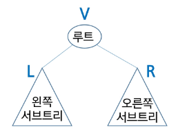

# 이진 트리 순회
- 순회란 트리의 각 노드를 중복되지 않게 전부 방문(visit) 하는 것을 말하는데 트리는 비 선형 구조이기 때문에 선형구조에서와 같이 **선후 연결 관계를 알 수 없다.**
- 따라서 특별한 방법이 필요함

# 순회(traversal)
- 트리의 노드들을 체계적으로 방문하는 것
- 3가지의 기본적인 순회 방법
    - 전위 순회(preorder traversal): VLR
        - 부모 노드 방문 후, 자식 노드를 좌,우 순서를 방문한다.
    - 중위 순회(inorder traversal): LVR
        - 왼쪽 자식 노드, 부모 노드, 오른쪽 자식 노드 순으로 방문한다.
    - 후위 순회 (postorder traversal): LRV
        - 자식노드를 좌우 순서로 방문한 후, 부모 노드로 방문한다.
    

# 전위 순회(pre-order traversal)
- 수행방법
    1. 현재 노드 T를 방문하여 처리한다. -> V
    2. 현재 노드 T의 왼쪽 서브 트리로 이동한다. -> L
    3. 현재 노드 T의 오른쪽 서브 트리로 이동한다. -> R
- 수행순서
    1. A->T1->T2
    2. A->B(T3)E->CFG
    3. ABDHIECFG


#  전위 순회(pre-order traversal)구현
```python
class TreeNode:
    def __init__(self, key):
        self.left = None
        self.right = None
        self.val = key

def preorder_traversal(root):
    if root:
        print(root.val) # 방문
        preorder_traversal(root.left)
        preorder_traversal(root.right)
```

# 중위 순회(in-order traversal)
- 수행 방법
    1. 현재 노드 T의 왼쪽 서브 트리로 이동한다. -> L
    2. 현재 노드 T를 방문하여 처리한다. -> V
    3. 현재 노드 T의 오른쪽 서브 트리로 이동한다. -> R
- 수행 순서
    1. T1->A->T2
    2. (T3)BE -> A -> FCG
    3. HDIB EAFCG


# 중위 순회(in-order traversal)구현
```python
class TreeNode:
    def __init__(self,key):
        self.left = None
        self.right = None
        self.val = key

def inorder_traversal(root):
    if root :
        inorder_traversal(root.left)
        print(root.val) # 방문
        inorder_traversal(root.right)
```

# 후위 순회(post-order traversal)
- 수행 방법
    1. 현재 노드 T의 왼쪽 서브 트리로 이동한다. -> L
    2. 현재 노드 T의 오른쪽 서브 트리로 이동한다. -> R
    3. 현재 노드 T를 방문하여 처리한다. -> V
- 수행 순서
    1. T1->T2->A
    2. (T3)EB -> FGC -> A ->
    3. HID E B F G C A


# 후위 순회(post-order traversal)구현
```python
class TreeNode:
    def __init__(self,key):
        self.left = None
        self.right = None
        self.val = key

def postorder_traversal(root):
    if root:
        inorder_traversal(root.left)
        inorder_traversal(root.right)
        print(root.val) # 방문
```

# 수식 트리 (Expression Tree)
- 수식을 표현하는 이진 트리
- 수식 이진 트리 (Expression binary Tree)라고 부르기도 함
- 연산자는 루트 노드이거나 가지 노드
- 피연산자는 모두 잎 노드


# 중위 순회 : A / B * C * D + E (식의 중위 표기법)
# 후위 순회 : A B / C * D * E + (식의 후위 표기법)
# 전위 순회 : + * * / A B C D E (식의 전위 표기법)


# 트리 탐색
- 비선형구조인 트리, 그래프의 각 노드(정점)를 중복되지 않게 전부 방문(visit) 하는 것을 말하는데 비선형 구조는 선형구조에서와 같이 **선후 연결 관계를 알 수 없다.** -> 특별한 방법 필요!

# 두가지 방법
    - 깊이 우선 탐색 (Depth First Search, DFS)
    - 너비 우선 탐색 (Breadth First Search, BFS)