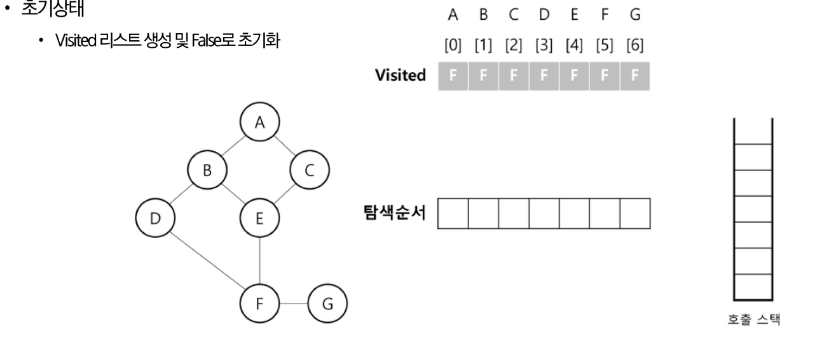
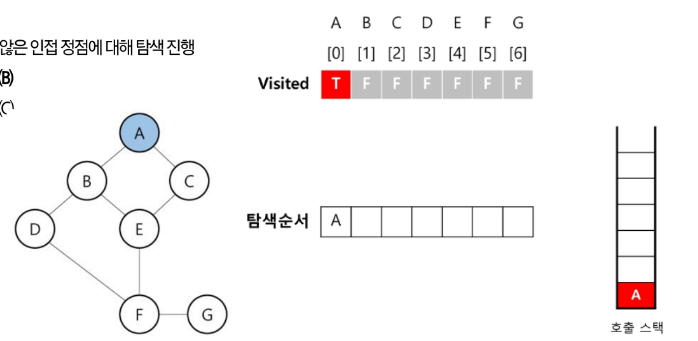
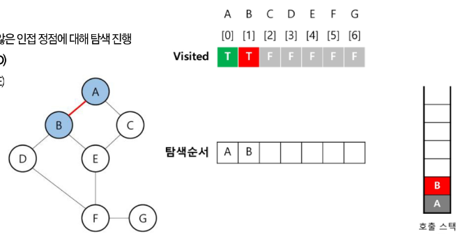
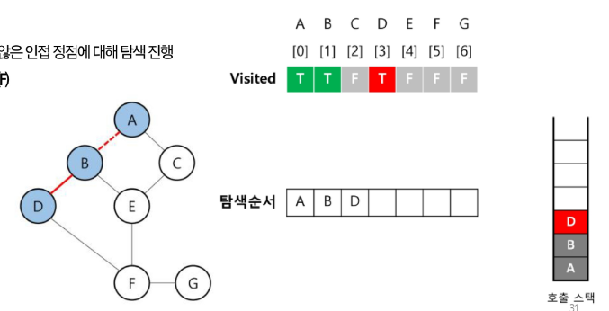
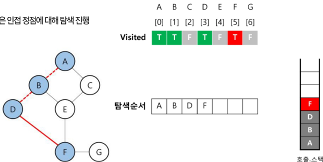
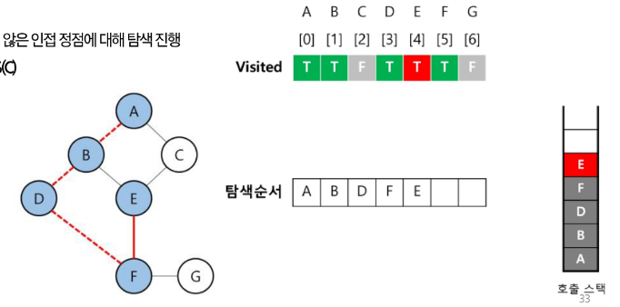
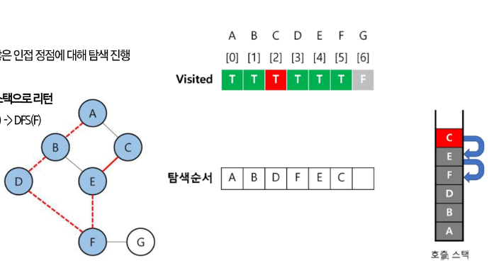
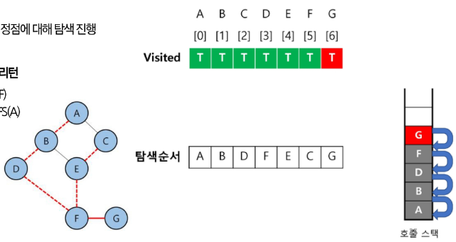
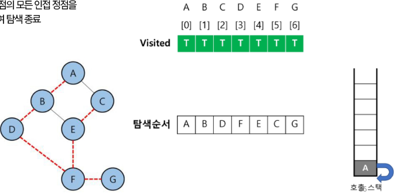

# DFS(그래프)
- 시작 정점에서 출발하여, 한 방향으로 갈 수 있는 경로가 있는 곳까지 깊이 탐색해 가다가 더 이상 갈 곳이 없게 되면, 가장 마지막에 만났던 갈림길 간선이 있는 정점으로 되돌아와서 다른 방향의 정점으로 탐색을 계속 방문하여 , 결국 모든 정점을 방문하는 순회 방법

# DFS(그래프) 알고리즘
- 초기상태
    - Visited 리스트 생성 및 False로 초기화


- 탐색 진행
    - 방문하지 않은 인접 정점에 대해 탐색 진행
        - **DFS(B)**
        - DFS(C)


- 탐색 진행
    - DFS(B)
    - 방문하지 않은 인접 정점에 대해 탐색 진행
        - **DFS(D)**
        - DFS(E)


- 탐색 진행
    - DFS(D)
    - 방문하지 않은 인접 정점에 대해 탐색 진행
        - **DFS(F)**


- 탐색 진행
    - DFS(F)
    - 방문하지 않은 인접 정점에 대해 탐색 진행
        - **DFS(E)**
        - DFS(G)


- 탐색 진행
    - DFS(E)
    - 방문하지 않은 인접 정점에 대해 탐색 진행
        - **DFS(C)**


- 탐색 진행
    - DFS(C)
    - 방문하지 않은 인접 정점에 대해 탐색 진행
        - **없음**
    - **이전 호출 스택으로 리턴**
        - DFS(E) -> DFS(F)


- 탐색 진행
    - DFS(G)
    - 방문하지 않은 인접 정점에 대해 탐색 진행
        - **없음**
    - **이전 호출 스택으로 리턴**
        - DFS(E) -> DFS(F) -> DFS(B) -> DFS(A)


- 탐색 종료
    - 탐색 시작 정점의 모든 인접 정점을 모두 방문하여 탐색 종료


# DFS(그래프) 알고리즘 코드 구현
```python
def dfs(current, adj_matrix, visited):
    visited[current] = True

    for i in range(len(adj_matrix)):
        if adj_matrix[current][i] and not visited[i]:
            dfs(i, adj_matrix, visited)

# 정점 수 = N
N = 5
adj_matrix = [
    [0, 1, 1, 0, 0],
    [1, 0, 0, 1, 1],
    [1, 0, 0, 0, 1],
    [0, 1, 0, 0, 1],
    [0, 1, 1, 1, 0]
]
visited = [False] * N

for i in range(N):
    if visited[i]: continue
    dfs(0, adj_matrix, visited)

# current: 탐색 정점
# adjMatrix: 인접 행렬
# visited: 방문 체크 리스트:
```