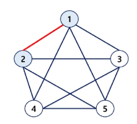

# 그래프
- 아이템들과 이들 사이의 연결 관계를 표현한다.
- 그래프는 정점(Vertex)들의 집합과 이들을 연결하는 간선(Edge)들의 집합으로 구성된 자료 구조
    - 정점(Vertex):그래프의 구성요소로 하나의 연결점
    - 간선(Edge):두 정점을 연결하는 선
    - 차수(Degree):정점에 연결된 간선의 수
- 그래프 간선 수
    - V: 정점의 개수, E: 그래프에 포함된 간선의 개수
    - V개의 정점을 가지는 그래프는 최대 V*(V - 1)/2 간선이 가능
    - 예: 5개 정점이 있는 그래프의 최대 간선 수는 (5*4/2) 10개
- 선형 자료구조나 트리 자료구조로 표현하기 어려운 N:M관계를 가지는 원소들을 표현하기에 용이하다.

# 그래프 유형
- 무방향 그래프(Undirected Graph)
- 방향 그래프(Directed Graph)
- 가중치 그래프(Weighted Graph)
- 사이클 없는 방향 그래프(DAG, Directed Acyclic Graph)
- 트리(Tree)

- 완전 그래프
    - 정점들에 대해 가능한 모든 간선들을 가진 그래프
- 부분 그래프
    - 원래 그래프에서 일부의 정점이나 간선을 제외한 그래프
- 트리도 그래프이다.
    - 각 노드는 최대 하나의 부모 노드가 존재할 수 있다.
    - 각 노드는 자식 노드가 없거나 하나 이상이 존재할 수 있다.
    - 두 노드 사이에는 유일한 경로가 존재한다.

# 인정(Adjacency)
- 두개의 정점에 간선이 존재(연결됨)하면 서로 인접해 있다고 한다.
- 완전 그래프에 속한 임의의 두 정점들은 서로 인접해 있다.
- 두 정점 1과2는 서로 인접해 있다.

# 그래프 경로
- 경로(Path)란 어떤 정점 A에서 시작하여 다른 정점 B로 끝나는 순회로 두 정점 사이를 잇는 간선들을 순서대로 나열한 것
    - 같은 정점을 거치지 않는 간선들의 sequence
    - 어떤 정점에서 다른 정점으로 가는 경로는 여러가지일 수 있다.
    - 0-6의 경로 예시
        - 정점들: 0 - 2 - 4 - 6
        - 간선들: (0,2), (2,4), (4,6)
    - 경로중 한 정점을 최대한 한 번만 지나는 경로를 **단순 경로**라 한다.
        - 0 - 2 - 4 - 6 , 0 - 1 - 6
    - 시작한 정점에서 끝나는 경로를 **사이클(Cycle)**이라고 한다.
        - 1 - 3 - 5 - 1

# 싸이클(Cycle)
- 경로의 시작 정점과 끝 정점이 같음
- 시작한 정점에서 끝나는 경로
    - 1 - 3 - 5 - 1
- 많은 그래프 알고리즘들이 싸이클 여부에 따라 다르게 동작함

# 그래프 표현
- 간선의 정보를 저장하는 방식, 메모리나 성능을 고려해서 결정
- **인접 행렬(Adjacent matrix)**
    - V * V 크기의 2차원 배열을 이용해서 간선 정보를 저장
- **인접 리스트(Adjacent List)**
    - 각 정점마다 다른 정점으로 나가는 간선의 정보를 저장
- **간선 리스트(Edge List)**
    - 간선(시작 정점, 끝 정점)의 정보를 객체로 표현하여 리스트에 저장

# 인접 행렬
- 두 정점을 연결하는 간선의 유무를 행렬로 표현
    - V*V 정방 행렬(행의 수와 열의 수가 같은 행렬)
    - 행 번호와 열 번호는 그래프의 정점에 대응
    - 두 정점이 인접되어 있으면 1, 그렇지 않으면 0으로 표현
- 무향 그래프
    - i번째 행의 합 = i번째 열의 합 = Vi의 차수
- 유향 그래프
    - 행i의 합 = Vi의 진출 차수
    - 열i의 합 = vi의 진입 차수

# 인접 행렬 정리
- 장점
    - 두 정점 사이에 간선이 있는지 확인하는 연산이 O(1)로 빠름
    - 구현이 단순
    - 정적 그래프에 적합(정적 그래프: 정점과 간선의 개수가 변하지 않음)
- 단점
    - 많은 메모리를 차지함(공간 복잡도 : O(V2))
    - 간선 수를 확인하거나 인접한 정점을 나열하는 연산이 느림
- 사용하기 좋은 상황
    - Dense Graph(밀집그래프)에 적합
    - 두 정점 사이에 간선이 있는지 빠르게 확인해야 하는 경우

# 인접 리스트
- 각 정점에 대한 인접 정점들을 순차적으로 표현
- 하나의 정점에 대한 인접 정점들을 각각 노드로 하는 연결 리스트로 저장

# 인접 리스트 정리
- 장점
    - 필요한 공간만 사용하므로 공간 복잡도 O(V + E)
    - 인접한 정점을 나열하는 연산이 빠름
- 단점
    - 두 정점 사이에 간선이 있는지 확인하는 연산이 느림( O(V) )
    - 링크드리스트로 구현이 복잡
- 사용하기 좋은 상황
    - Sparse Graph(희소 그래프)에 적합
    - 그래프가 동적으로 변하는 경우(정점과 간선이 자주 추가/삭제)
    - 인접한 정점을 자주 순회해야 하는 경우

# 간선 리스트
- 두 정점에 대한 간선 그 자체를 객체로 표현하여 리스트로 저장
- 간선을 표현하는 두 정점의 정보를 나타냄(시작 정점, 끝 정점)

# 간선 리스트 정리
- 장점
    - 필요한 간선만 저장하므로 공간 복잡도 O(E)
    - 간선을 직접 다루는 연산에 효율적
- 단점
    - 두 정점 사이에 간선이 있는 지 확인하는 연산이 느림( O(E) )
    - 특정 정점에 인접한 정점을 찾는 연산이 느림( O(E) )
- 사용하기 좋은 상황
    - 간선 중심 연산을 자주 수행해야 하는 경우(예:MST)
