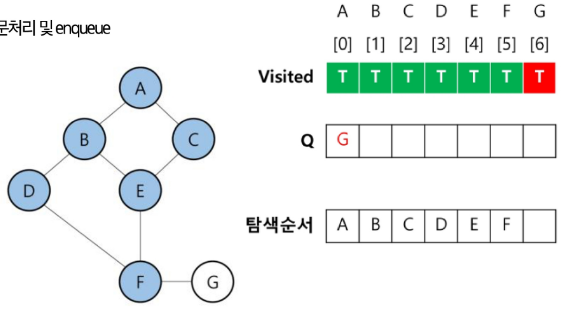

# BFS(그래프)
- 탐색 시작점의 인접한 정점들을 모두 차례로 방문한 후에, 방문했던 정점을 시작점으로 하여 다시 인접한 정점들을 차례로 방문하는 방식

# BFS(그래프) 알고리즘
- 초기상태
    - Visited 리스트 생성 및 False로 초기화
    - Q 생성
    - 시작 정점(A) 방문처리 및 enqueue


# BFS(그래프) 알고리즘
- 탐색 진행
    - Dequeue A
    - A의 인접 정점 방문처리 및 enqueue


# BFS(그래프) 알고리즘
- 탐색 진행
    - Dequeue B
    - B의 인접 정점 방문처리 및 enqueue


# BFS(그래프) 알고리즘
- 탐색 진행
    - Dequeue C
    - C의 인접 정점 방문처리 및 enqueue
        - 없음


# BFS(그래프) 알고리즘
- 탐색 진행
    - Dequeue D
    - D의 인접 정점 방문처리 및 enqueue


# BFS(그래프) 알고리즘
- 탐색 진행
    - Dequeue E
    - E의 인접 정점 방문처리 및 enqueue


# BFS(그래프) 알고리즘
- 탐색 진행
    - Dequeue F
    - F의 인접 정점 방문처리 및 enqueue


# BFS(그래프) 알고리즘
- 탐색 진행
    - Dequeue G
    - G의 인접 정점 방문처리 및 enqueue
        - 없음
    - Q가 비었으므로 **탐색종료**


# BFS(그래프) 알고리즘 코드 구현
```python
from collections import deque

def bfs(start):
    node = list(graph.keys())
    visited = [False] * len(nodes)
    queue = deque([start])
    result = []

    start_index = nodes.index(start)
    visited[start_index] = True

    while queue:
        vertex = queue.popleft()
        result.append(vertex)

        for neighbor in graph[vertex]:
            neighbor_index = nodes.index(neighbor)
            if not visited[neighbor_index]:
                queue.append(neighbor)
                visited[neighbor_index] = True
    return result
 
graph = {
    'A' : ['B', 'C'],
    'B' : ['A', 'D', 'E'],
    'C' : ['A'],
    'D' : ['B', 'F'],
    'E' : ['B', 'F'],
    'F' : ['D', 'F', 'G'],
    'G' : ['F']
}
nodes = list(graph.keys())
visited = [[False] * len(nodes)]
result = []
for node in nodes:
    if not visited[nodes.index(node)]:
        result.extend(bfs(node))
print("그래프 탐색 경로:", result)
```