# BFS - 트리
- 루트 노드의 **자식 노드들을 먼저 모두 차례로 방문**한 후에, 방문했던 자식 노드들을 기준으로 하여 다시 해당 노드의 자식 노드들을 차례로 방문하는 방식
- 인접한 노드들에 대해 탐색을 한 후, 차례로 다시 너비우선탐색을 진행해야 하므로, 선입선출 형태의 자료구조인 **큐**를 활용

# BFS 트리 알고리즘
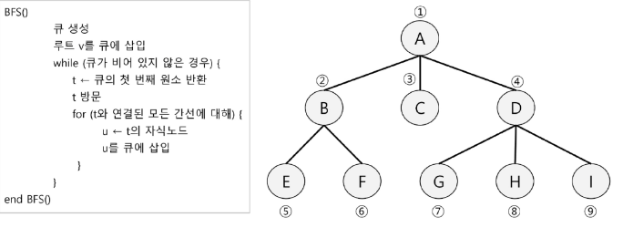

# BFS 알고리즘 
- 큐(Q) 생성
- 루느토트 enqueue
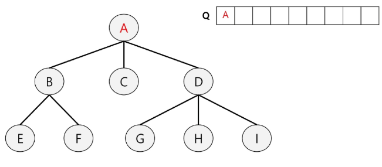

# BFS 알고리즘
- dequeue A
- A의 자식 노드 enqueue
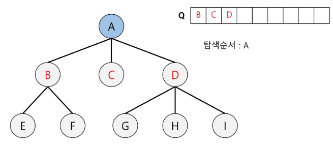

# BFS 알고리즘
- dequeue B
- B의 자식 노드 enqueue
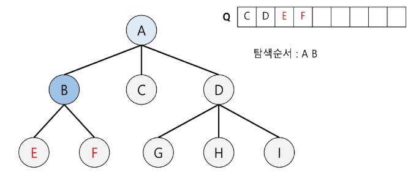

# BFS 알고리즘
- dequeue C
- C의 자식 노드 enqueue
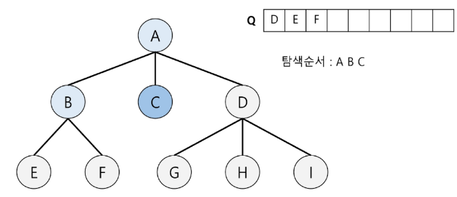

# BFS 알고리즘
- dequeue D
- D의 자식 노드 enqueue
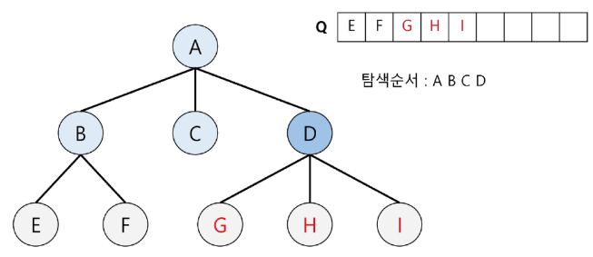

# BFS 알고리즘
- dequeue E
- E의 자식 노드 enqueue : 없음
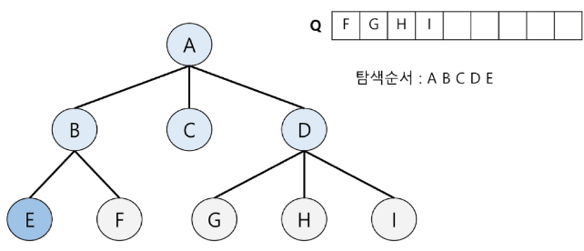

# BFS 알고리즘
- dequeue F
- F의 자식 노드 enqueue : 없음
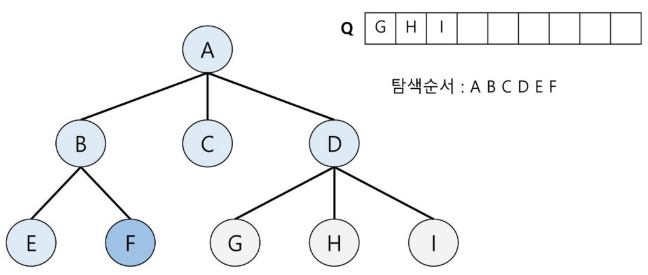

# BFS 알고리즘
- dequeue G
- G의 자식 노드 enqueue : 없음
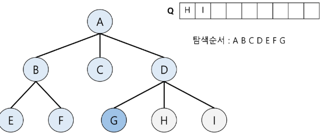

# BFS 알고리즘
- dequeue H
- H의 자식 노드 enqueue : 없음
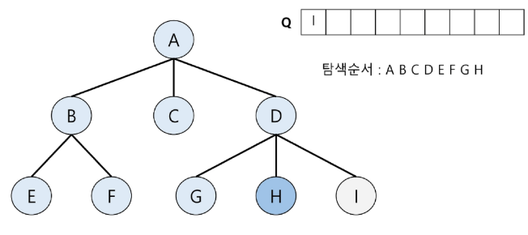

# BFS 알고리즘
- dequeue I
- I의 자식 노드 enqueue : 없음
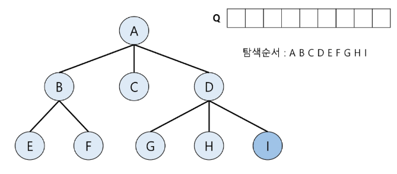

# BFS 알고리즘
- Q가 비어있으므로 탐색 종료
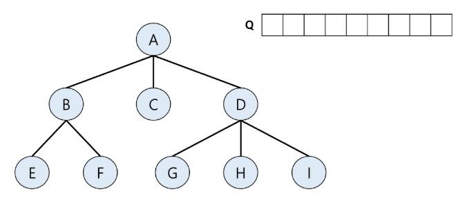

```python
from collections import deque

def bfs_tree(tree,root_node):
    queue = deque([root_node])
    result = []

    while queue:
        node = queue.popleft()
        result.append(node)
        if node not in tree: continue
        for child in tree[node]:
            queue.append(child)
    
    return result

tree = {'A' : ['B','C','D'],
        'B' : ['E','F'],
        'D' : ['G','H','I'], }

root_node = 'A'
result = bfs_tree(tree, root_node)

print(' '.join(result))
```