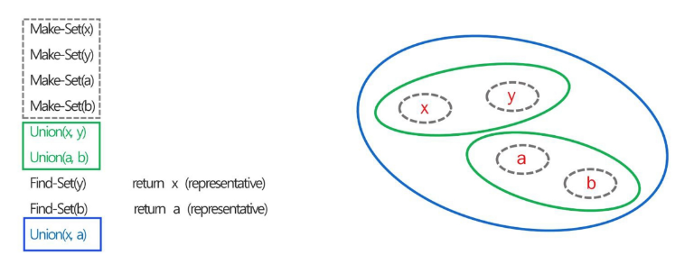
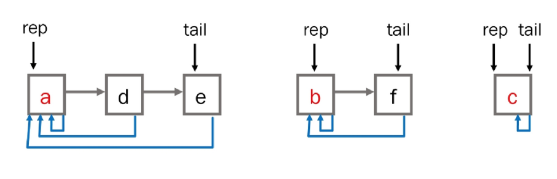
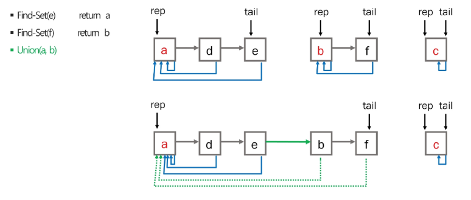
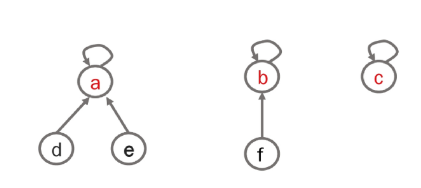
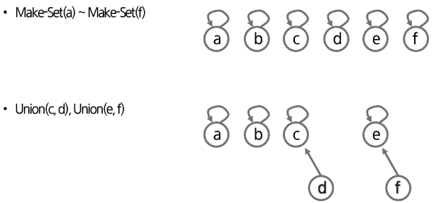
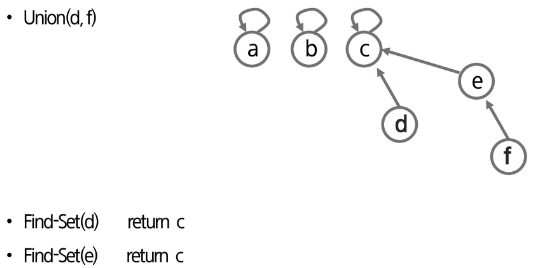
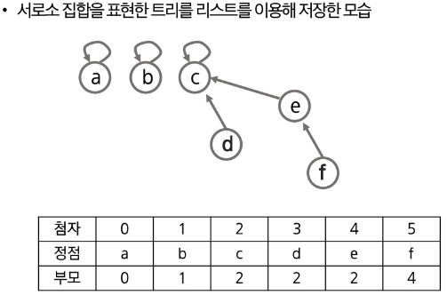
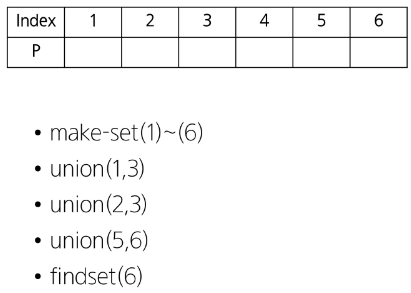
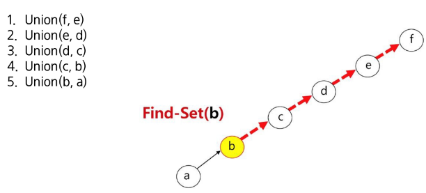

# 서로소 집합 (Disjoint-set)
- 서로소 또는 상호베타 집합들은 서로 중복 포함된 원소가 없는 집합들이다. 다시 말해 , 교집합이 없다.
- 두 집합 간에 공통 원소가 하나도 없을 때, 이 두 집합을 서로소 집합이라고 한다.
- 집합에 속한 하나의 특정 멤버를 통해 각 집합들을 구분한다. 이를 대표자(representative)라 한다.

# 서로소 집합 (Disjoint-set)
- 상호베타 집합을 표현하는 방법
    - 연결 리스트
    - 트리
- 상호베타 집합 연산
    - Make-Set(x)
    - Find-Set(x)
    - Union(x,y)

# 서로소 집합 (Disjoint-set)의 예


# 서로소 집합 표현: 연결리스트 - (1/2)
- 같은 집합의 원소들은 하나의 연결리스트로 관리한다.
- 연결리스트의 맨 앞의 원소를 집합의 대표 원소로 삼는다.
- 각 원소는 집합의 대표원소를 가리키는 링크를 갖는다.


# 서로소 집합 표현: 연결리스트 - (2/2)


# 서로소 집합 표현: 트리 - (1/4)
- 같은 집합의 원소들을 하나의 트리로 표현한다.
- 자식 노드가 부모 노드를 가리키며 루트 노드가 대표자가 된다.


# 서로소 집합 표현: 트리 - (2/4)


# 서로소 집합 표현: 트리 - (3/4)


# 서로소 집합 표현: 트리 - (4/4)


# 서로소 집합 연산 : make_set(x)
- 유일한 멤버 x를 포함하는 새로운 집합을 생성하는 연산
```python
p = [0] * (N+1)

def make_set(x):
    p[x] = x
```

# 서로소 집합 연산 : find_set(x)
- x를 포함하는 집합을 찾는 연산
```python
def find_set(x):
    if x == p[x]:
        return x
    return find_set(p[x])
```

# 서로소 집합 연산 : union_set(x)
- x와 y를 포함하는 두 집합을 통합하는 연산
```python
def union(x,y):
    px = find_set(x)
    py = find_set(y)

    # 작은 값이 대장이다.라는 규칙을 정함.
    if px < py:
        p[py] = px  # 대장을 인정하는 과정의 코드
    else:
        p[px] = py
```

# 연습하기 
```python
p = [0] * (N+1)

def make_set(x):
    p[x] = x

def find_set(x):
    if x == p[x]:
        return x
    return find_set(p[x])

def union(x,y):
    px = find_set(x)
    py = find_set(y)

    if px < py:
        p[py] = px
    else:
        p[px] = py
```


# 서로소 집합 연산의 문제점

- 단순한 Union 연산을 사용할 때 트리가 일직선으로 편향될 수 있다는 점
