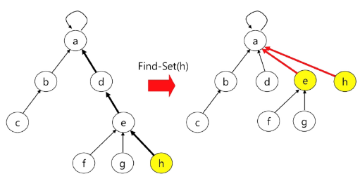
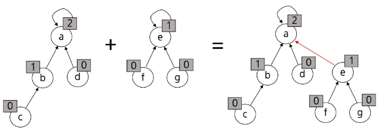
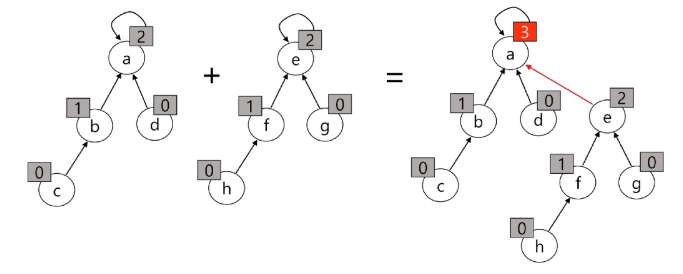

# 서로소 집합 연산의 효율을 높이는 방법
- 서로소 집합 최적화
- Path compression
    - Find-Set을 행하는 과정에서 만나는 **모든 노드들이 직접 root를 가리키도록** 포인터를 바꾸어 준다.
- Rank를 이용한 Union
    - 각 노드는 자신을 루트로 하는 subtree의 높이를 rank로 저장한다
    - 두 집합을 합칠 때 rank가 낮은 집합을 rank가 높은 집합에 붙인다

# Path Compression - (1/2)
- Path Compression을 적용한 Find-Set 연산은 특정 노드에서 루트까지의 경로를 찾아 가면서 부모 노드를 갱신한다.


# Path Compression - (2/2)
- find_set(x) 최적화
    - x를 포함하는 집합을 찾는 오퍼레이션
- find_set 연산은 특정 노드에서 루트까지의 경로를 찾아 가면서 노드의 부모 정보를 갱신한다.
```python
# 최적화 전
def find_set(x):
    if x == p[x]:
        return x
    return find_set(p[x])

# 최적화 후
def find_set(x):
    if x != p[x]:
        p[x] = find_set(p[x])
    return p[x]
```

# Rank를 이용한 Union - (1/3)


# Rank를 이용한 Union - (2/3)


# Rank를 이용한 Union - (3/3)
- Rank를 저장할 변수 추가 및 랭크 비교 및 저장
```python
# 최적화 전
p = [0] * (N+1)
def make_set(x):
    p[x] = x

def union(x,y):
    px = find_set(x)
    py = find_set(y)

    if px < py:
        p[py] = px
    else:
        p[px] = py
```

```python
# 최적화 후
p = [0] * (N+1)
def make_set(x):
    p[x] = x

def union(x,y):
    px = find_set(x)
    py = find_set(y)

    if px != py:
        if rank[px] > rank[py]:
            p[py] = px
        elif rank[px] < rank[py]:
            p[px] = py
        else:
            p[py] = px
            rank[px] += 1
```