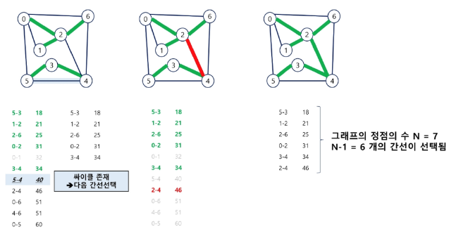

# Kruskal 알고리즘
1. 간선을 하나씩 선택해서 MST를 찾는 알고리즘
2. 최초, 모든 간선을 가중치에 따라 **오름차순**으로 정렬
3. 가중치가 가장 낮은 간선부터 선택
    - 선택한 간선의 두 정점에 대해서 아래 상황에 따라 진행
        1. 두 대표자가 다르다면, 엣지를 최소 비용 집합에 추가
        2. 두 대표자가 같다면, 사이클이 생성되므로 무시
4. n-1개의 간선이 선택될 때까지 **2번 과정**을 반복

# Kruskal 알고리즘 예시


# Kruskal 알고리즘 예시(2)


# Kruskal 알고리즘 예시(3)


# Kruskal 알고리즘 코드 구현 - DisjointSet
```python
class DisjoinSet:
    def __init__(self,v):
        self.p = [0] * (len(v) + 1)
    
    def make_set(self,x):
        self.p[x] = x
    
    def find_set(self,x):
        if x != self.p[x]:
            self.p[x] = self.find_set(self.p[x])
        return self.p[x]
    
    def union(self,x,y):
        px = self.find_set(x)
        py = self.find_set(y)

        if px < py:
            self.p[py] = px
        else:
            self.p[px] = py
    
    def mst_kruskal(vertices, edges):
        mst = []
        n = len(vertices)
        ds = Disjointset(vertices)

        for i in range(n+1):
            ds.make_set(i)
        
        edges.sort(key=lambda x: x[2])
        for edge in edges:
            s, e, w = edge
            if ds.find_set(s) != ds.find_set(e):
                ds.union(s,e)
                mst.append(edge)
        return mst
    
    # [시작지점, 도착지점, 가중치]
    edges = [[1,2,1], [2, 3, 3], [1, 3, 2]]
    vertices = [1, 2, 3] # 정점 집합
    mst_kruskal(vertices,edges) # [[1, 2, 1], [1, 3, 2]]
```

# Kruskal 알고리즘 정리
- 특징
    - 그리디 알고리즘을 활용
    - 간선을 가중치 순으로 정렬하여 처리
    - Disjoint를 사용하여 사이클 형성을 방지
- 장점
    - 희소 그래프에서 효율적
    - 간선 중심 알고리즘
    - 음의 가중치도 처리할 수 있음
- 단점
    - 간선 정렬이 필요함
    - 동적 그래프에 적용하기 어려움
- 시간 복잡도 : O(E log E) or O(E log V)