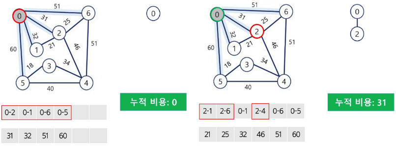
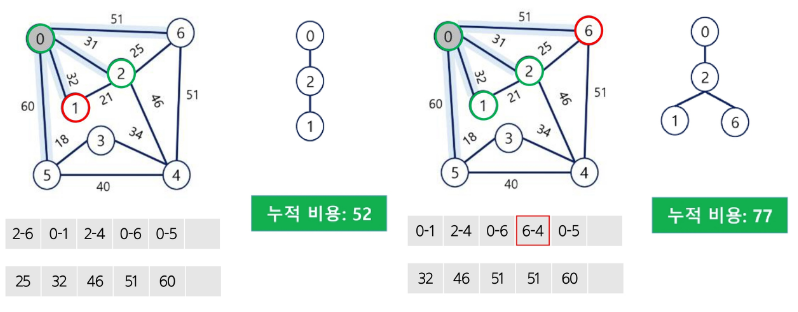
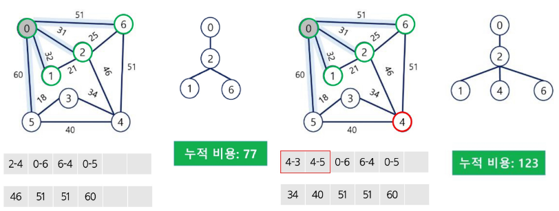
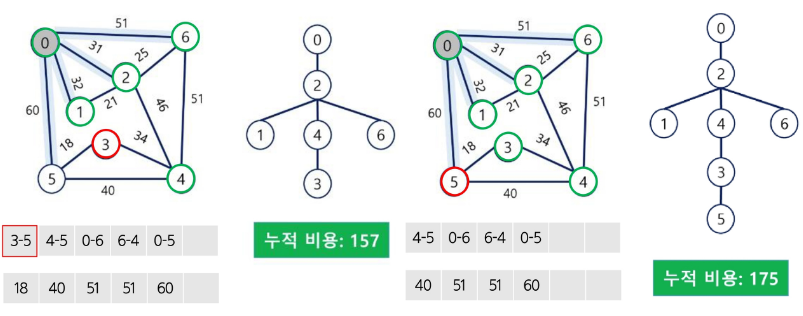

# Prim 알고리즘
- 하나의 정점에서 연결된 간선들 중에 하나씩 선택하면서 MST를 만들어가는 방식
    1. 임의 정점을 하나 선택해서 시작
    2. 우선순위 큐를 사용하여 간선의 가중치가 가장 작은 간선을 선택
    3. 가장 가중치가 작은 간선을 선택하고, 이 간선이 연결하는 정점이 이미 방문한 정점이 아니라면, 이 간선을 최소 신장 트리에 추가하고, 그 정점을 방문한 것으로 표시
    4. 우선순위 큐가 빌 때까지 위 과정을 반복

# Prim 알고리즘 - (1/4)


# Prim 알고리즘 - (2/4)


# Prim 알고리즘 - (3/4)


# Prim 알고리즘 - (4/4)


# Prim 알고리즘 코드 구현
```python
import heapq
def prim(vertices, edges):
    mst = []

    adj_list = {v: [] for v in vertices}
    for start_v, end_v, w in edges:
        adj_list[start_v].append((end_v,w))
        adj_list[end_v].append((start_v,w))

    visited = set()
    init_vertec = vertices[0]
    min_heap = [[w, init_vertex, e] for e,w in adj_list[init_vertex]]
    heapq.heapify(min_heap)
    visited.add(init_vertex)

    while min_heap:
        weight, start_v, end_v = heapq.heappop(min_heap)
        if end_v in visited: continue

        visited.add(end_v)
        mst.append((start_v, end_v, weight))

        for adj_v, adj_w in adj_list[end_v]:
            if adj_v in visited: continue
            heapq.heappush(min_heap, [adj_w,end_v, adj_v])
    return mst

vertices = [1,2,3]
edges = [[1, 2, 30], [2, 3, 20], [1, 3, 10]]
mst = prim(vertices, edges) # [(1, 3, 10) , (3, 2, 20)]
```

# Prim 알고리즘 정리
- 특징
    - 그리디 알고리즘을 활용
    - 각 단계에서 인접한 간선 중 가장 가중치가 작은 간선을 선택
- 장점
    - 밀집 그래프에서 효율적
    - 정점 중심의 알고리즘
- 단점
    - 희소 그래프에서 비효율적
    - 음의 가중치를 처리할 수 없음
- 시간 복잡도 : O((V+E) log V)