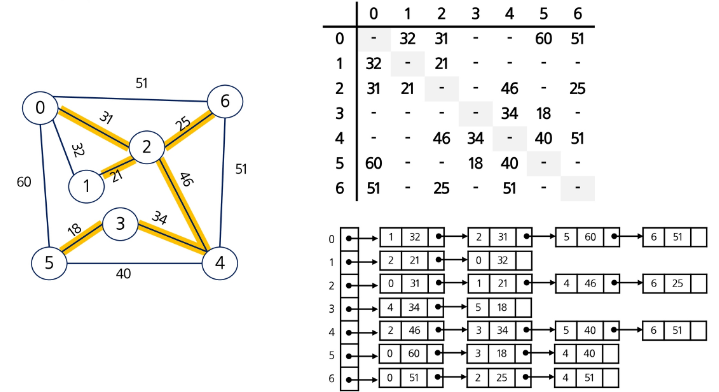
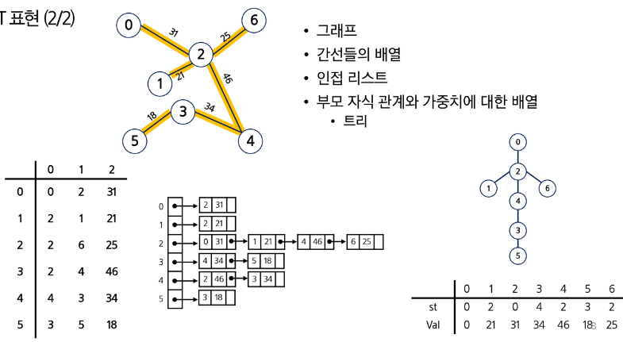

# 최소 신장 트리
# 신장 트리 (Spanning Tree)
- n개의 정점으로 이루어진 무향 그래프에서 n개의 정점과 n-1개의 간선으로 이루어진 트리

# 최소 신장 트리 (Minimum Spanning Tree)
- 무향 가중치 그래프에서 신장 트리를 구성하는 간선들의 가중치의 합이 최소인 신장 트리

# 그래프에서 최소 비용 문제
- 모든 정점을 연결하는 간선들의 가중치의 합이 최소가 되는 트리
- 두 정점 사이의 최소 비용의 경로 찾기

# 최소 신장 거리
## MST 표현 (1/2)

## MST 표현 (2/2)

## MST 구현에는 아래 두 가지 알고리즘을 활용한다.
- Kruskal 알고리즘
- Prim 알고리즘