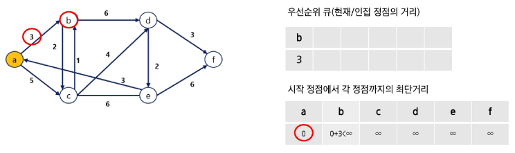
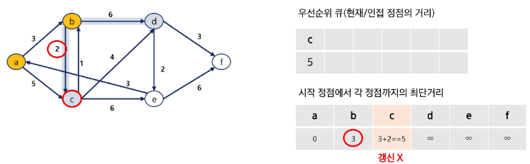

# Dijkstra Algorithm
- 시작 정점에서 다른 모든 정점으로의 최단 경로를 구하는 알고리즘
- 시작 정점에서의 거리가 최소인 정점을 선택해 나가면서 최단 경로를 구하는 방식이다
- **탐욕 기법**을 사용한 알고리즘으로 MST의 프림 알고리즘과 유사하다
- **우선순위 큐**를 활용한다

# 다익스트라 알고리즘 동작 순서
- 현재 상황에서 가장 좋은 선택을 반복해서 최종 해답을 구하는 방식
1. 시작 정점에서 각 정점까지의 최단 거리를 저장할 리스트를 생성
    (모든 거리를 무한대로 초기화하고, 시작 정점의 거리는 0으로 설정)
2. 시작 정점과 거리를 우선순위 큐에 삽입
3. 가장 짧은 거리를 가진 정점을 추출하고, 추출한 정점과 인접한 정점을 모두 확인(기존 거리보다 멀면 무시)
4. 인접한 정점과의 거리가 기존에 저장된 거리보다 작으면, 거리를 갱신하고 우선순위 큐에 삽입
5. 우선순위 큐가 모두 빌 때까지 **3~4과정 반복**

# 다익스트라 알고리즘 예 - (1/12)

# 다익스트라 알고리즘 예 - (2/12)

# 다익스트라 알고리즘 예 - (3/12)

# 다익스트라 알고리즘 예 - (4/12)

# 다익스트라 알고리즘 예 - (5/12)

# 다익스트라 알고리즘 예 - (6/12)

# 다익스트라 알고리즘 예 - (7/12)

# 다익스트라 알고리즘 예 - (8/12)

# 다익스트라 알고리즘 예 - (9/12)

# 다익스트라 알고리즘 예 - (10/12)

# 다익스트라 알고리즘 예 - (11/12)

# 다익스트라 알고리즘 예 - (12/12)

# 다익스트라 알고리즘 구현
- 다익스트라.py 참고

# 다익스트라 알고리즘 정리
- 특징
    - 그리디 알고리즘
    - 단일 출발점에서 다른 모든 정점까지의 최단 경로를 찾음
- 장점
    - 실행 시간이 비교적 빠름
    - 동작 방식이 직관적이고 이해하기 쉬움
    - GPS 네비게이션, 네트워크 라우팅 등 실제 응용 분야가 많음
- 단점
    - **음의 가중치가 있는 그래프에서는 사용할 수 없음**
    - 모든 정점 쌍 간의 최단 경로를 구하려면 여러  번 실행해야 함
- 시간복잡도 : O ((V+E) log V)