# Bellman-Ford Algorithm
- 시작 정점에서 다른 모든 정점으로의 최단 경로를 구하는 알고리즘
- **음수 가중치**를 갖는 간선이 있는 그래프에서도 동작
- 다익스트라 알고리즘과 달리, 탐욕 기법 대신 **동적 프로그래밍(DP)** 접근을 사용한다
- 우선순위 큐를 사용하지 않는다

# 벨만-포드 알고리즘 동작 순서
1. 시작 정점에서 각 정점까지의 최단 거리를 저장할 리스트 생성
    (모든 거리를 무한대로 초기화하고, 시작 정점의 거리는 0으로 설정)
2. 모든 간선을 반복해서 검사하고, 각 간선을 통해 더 짧은 경로가 발견되면 거리를 업데이트
3. 마지막 정점을 제외한 모든 정점에 대해서 2번 과정 반복 (v - 1 번 탐색)
4. 마지막으로 한 번 더 모든 간선을 검사하여 거리가 갱신되면, 음수 사이클이 존재한다는 것을 의미

# 벨만-포드 알고리즘 예 - (1/17)
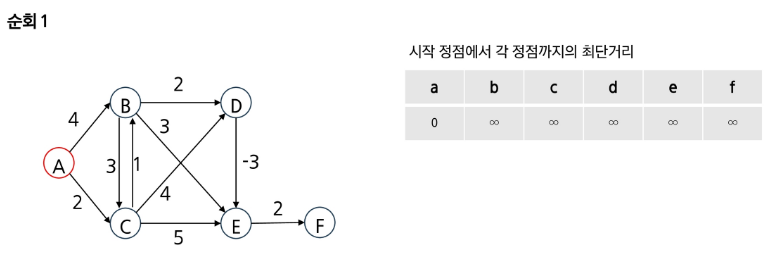
# 벨만-포드 알고리즘 예 - (2/17)
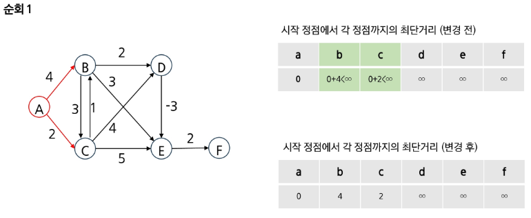
# 벨만-포드 알고리즘 예 - (3/17)
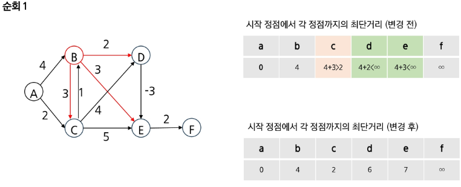
# 벨만-포드 알고리즘 예 - (4/17)
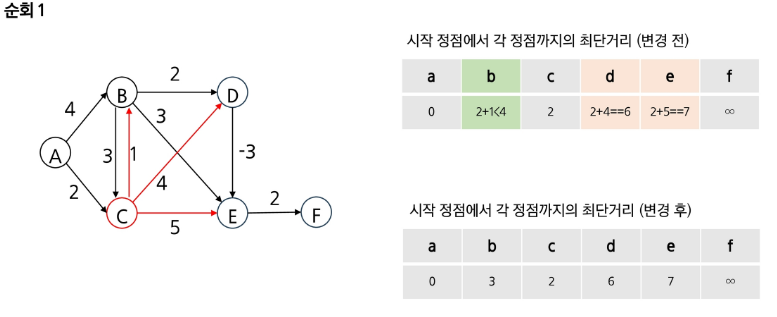
# 벨만-포드 알고리즘 예 - (5/17)

# 벨만-포드 알고리즘 예 - (6/17)
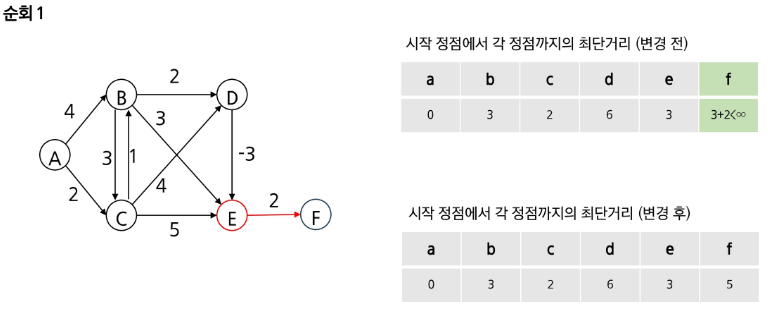
# 벨만-포드 알고리즘 예 - (7/17)
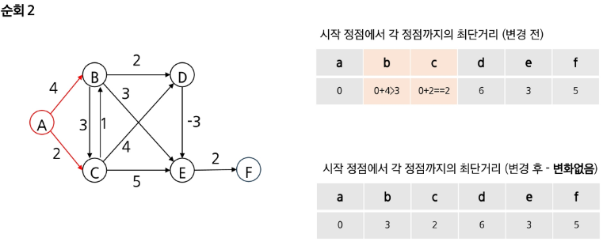
# 벨만-포드 알고리즘 예 - (8/17)
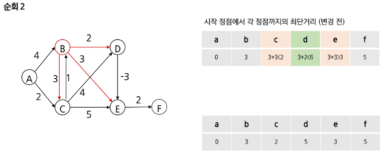
# 벨만-포드 알고리즘 예 - (9/17)
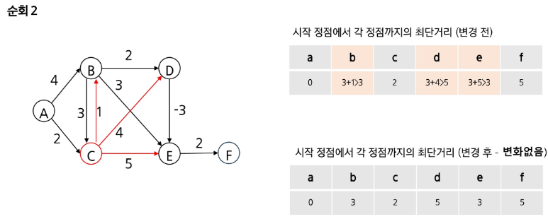
# 벨만-포드 알고리즘 예 - (10/17)
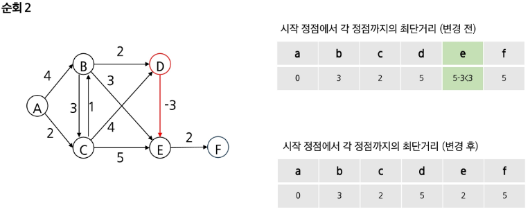
# 벨만-포드 알고리즘 예 - (11/17)
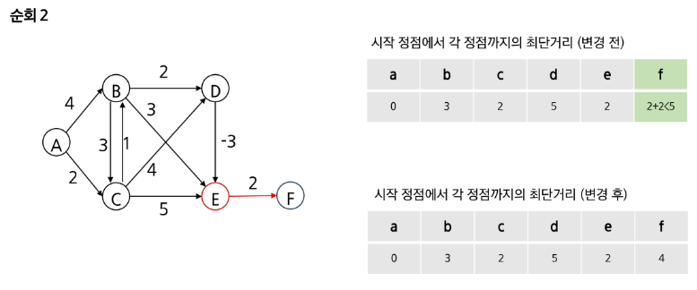
# 벨만-포드 알고리즘 예 - (12/17)
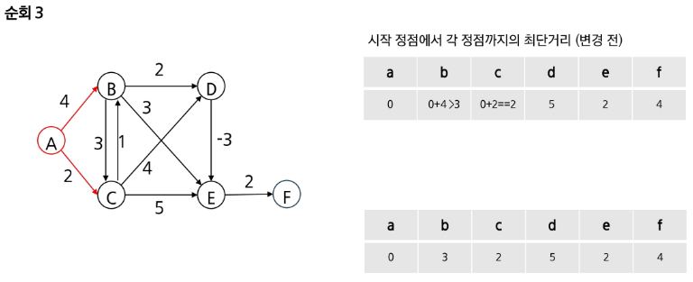
# 벨만-포드 알고리즘 예 - (13/17)
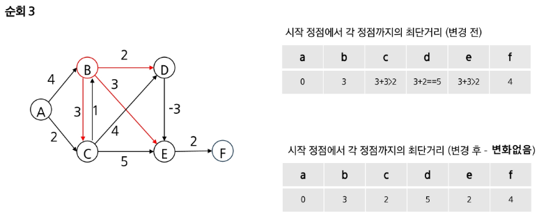
# 벨만-포드 알고리즘 예 - (14/17)
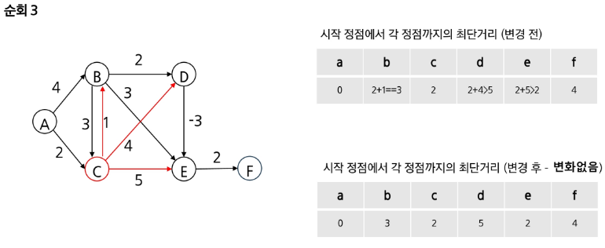
# 벨만-포드 알고리즘 예 - (15/17)
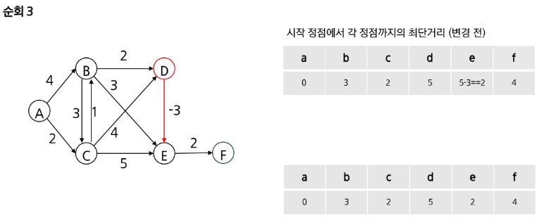
# 벨만-포드 알고리즘 예 - (16/17)
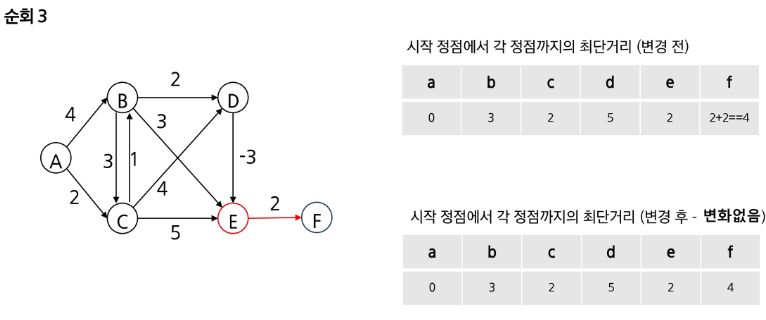
# 벨만-포드 알고리즘 예 - (17/17)
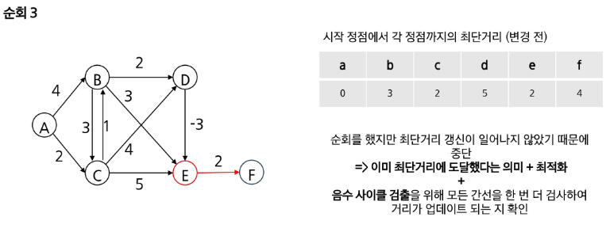

# 벨만-포드 알고리즘 구현 
- 벨만-포드.py 참고

# 벨만-포드 알고리즘 정리
- 특징
    - Dynamic programmin
    - 단일 출발점에서 다른 모든 정점까지의 최단 경로를 찾음
    - **음의 사이클을 감지**할 수 있음
- 장점
    - 구현이 간단
    - 음의 가중치를 가진 간선이 있는 그래프에서도 최단 경로를 찾을 수 있음
- 단점
    - 다익스트라 알고리즘보다 느림
    - 음의 사이클이 있는 경우에는 최단 경로를 찾을 수 없음
- 시간 복잡도: O (VE)