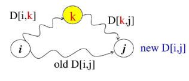

# Floyd-Warshall Algorithm
- 모든 정점 쌍 간의 최단 경로를 구하는 알고리즘
    - 다익스트라, 벨만포드는 정점과 정점간의 최단 경로를 구하는 알고리즘
- 동적 프로그래밍을 사용하여 최단 경로를 점진적으로 갱신
- **음수 가중치가 있어도 정상적으로 동작 (음수 사이클은 X)**
- 다익스트라 알고리즘과 시간 복잡도가 동일하지만 구현이 간단하다

# 플로이드-워셜 알고리즘 동작 원리 - (1/6)
- 동적 계획 알고리즘으로 모든 쌍 최단 경로 문제를 해결하려면 먼저 부분문제들을 찾아야 한다
- 이를 위해 일단 그래프의 정점의 수가 적을 때 생각해보자
- 그래프에 3개의 정점이 있는 경우, 정점 i에서 정점 j까지의 최단 경로를 찾으려면 2가지 경로, 즉, 정점 i에서 정점 j로 직접 가는 경로와 정점 1을 경유하는 경로 중에서 짧은 것을 선택하면 된다

# 플로이드-워셜 알고리즘 동작 원리 - (2/6)
- 또 하나의 중요한 아이디어는 경유 가능한 정점들을 정점 1로부터 시작하여, 정점1과 2, 그 다음엔 정점 1,2,3으로 하나씩 추가하여, 마지막에는 정점 1~n까지의 모든 정점을 경유 가능한 정점들로 고려하면서, 모든 쌍의 최단 경로의 거리를 계산한다. (DP)
- 부분문제 정의: 단, 입력 그래프의 정점을 각각 1,2,3,---,n이라 하자
- Dijk = 정점{1,2,...,k}만을 경유 가능한 정점들로 고려하여, 정점 i로부터 정점 j까지의 모든 경로 중에서 가장 짧은 경로의 거리

# 플로이드-워셜 알고리즘 동작 원리 - (3/6)
- 여기서 k ≠ i , k ≠ j 이고, k = 0 인 경우, 정점 0은 그래프에 없으므로 어떤 정점도 경유하지 않는다는 것을 의미, 따라서
    Dij0은 입력으로 주어지는 간선 (i,j)의 가중치이다
- Dij1은 i에서 정점 1을 경유하여 j로 가는 경로와 i에서 j로 직접 가는 경로 중에서 짧은 거리이다
- 따라서 모든 쌍 i와 j에 대하여 Dij1을 계산하는 것이 가장 작은 부분 문젲들이다. 단 i ≠ 1, j ≠ 1

# 플로이드-워셜 알고리즘 동작 원리 - (4/6)
- 그 다음엔 i에서 정점 2를 경유하여 j로 가는 경로의 거리와 Dij1중에서 짧은 거리를 Dij2로 정한다.
- 단, 정점2를 경유하는 경로의 거리는 Di21 + D2j1
- 모든 쌍 i와j에 대하여 Dij2를 계산하는 것이 그 다음으로 큰 부분 문제들이다 단 i ≠ 2, j ≠ 2

# 플로이드-워셜 알고리즘 동작 원리 - (5/6)
- k를 계속 늘려 정점 i에서 정점 k를 경유하여 j로 가는 경로의 거리와 Dijk-1중에서 짧은 거리를 Dijk로 정한다
- 단, 정점 k를 경유하는 경로의 거리는 Dikk-1 + Dkjk-1이고, i ≠ k, j ≠ k

# 플로이드-워셜 알고리즘 동작 원리 - (6/6)
- 이런 방식으로 k가 1에서 n이 될 때까지 Dijk를 계산해서, Dijn, 즉, 모든 정점을 경유 가능한 정점들로 고려한 모든 쌍 i와 j의 최단 경로의 거리를 찾는 방식이 플로이드-워셜의 모든 쌍 최단 경로 알고리즘

# 플로이드-워셜 알고리즘 코드 구현
- 플로이드-워셜.py 참고

# 플로이드-워셜 알고리즘 정리
- 특징
    - Dynamic Programming
    - 모든 정점 쌍 사이의 최단 경로를 찾는 알고리즘
- 장점
    - 구현이 간단
    - 모든 정점 쌍 사이의 최단 경로를 한 번에 계산할 수 있음
    - 음의 가중치를 가진 간선이 있는 그래프에서도 최단 경로를 찾을 수 있음
- 단점
    - 큰 그래프에서는 비효율적
    - 음의 사이클이 있는 경우에는 최단 거리를 구할 수 없음
- 시간 복잡도 : O(V3), 공간 복잡도: O(V2)