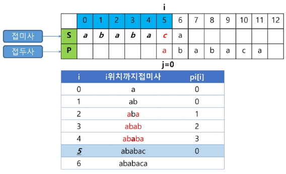

# KMP 알고리즘
- Knuth-Morris-Pratt Algorithm
- 불일치가 발생한 텍스트 문자열의 앞 부분에 어떤 문자가 있는지를 미리 알고 있으므로, 불일치가 발생한 앞 부분에 대하여 다시 비교하지 않고 매칭을 수행

- 패턴을 전처리하여 부분일치 테이블 배열 pi[k]을 구해서 잘못된 시작을 최소화함
    - pi[k] : 처음부터 k인덱스까지를 끝으로 하는 부분 문자열에서 접두사와 접미사가 일치하는 최대 길이
- 시간복잡도 : O(M + N)

# KMP 알고리즘 아이디어 - (1/2)
- 텍스트에서 abcdabc까지는 매치되고, e에서 실패한 상황 패턴의 맨 앞의 abd와 실패 작전의 abc는 동일함을 이용할 수 있다
- 실패한 텍스트 문자와 p[4]를 비교한다

# KMP 알고리즘 아이디어 - (2/2)
- 패턴의 0번째 인덱스를 제외한 각 인덱스마다 맨 앞부터 해당 인덱스까지의 부분문자열 중 접두사와 접미사가 일치하는 최대 길이로 계산하여 작성
- 맨 앞부터 해당 인덱스까지의 길이가 2 이상인 부분문자열 중 접두사이면서 접미사인 최대 문자열

# KMP 알고리즘 테이블 생성 - (1/8)
- 부분 일치 테이블 만들기

# KMP 알고리즘 테이블 생성 - (2/8)

# KMP 알고리즘 테이블 생성 - (3/8)

# KMP 알고리즘 테이블 생성 - (4/8)

# KMP 알고리즘 테이블 생성 - (5/8)

# KMP 알고리즘 테이블 생성 - (6/8)

# KMP 알고리즘 테이블 생성 - (7/8)

# KMP 알고리즘 테이블 생성 - (8/8)

# KMP 알고리즘 연습하기
- 부분일치 테이블 만들기 연습

# KMP 알고리즘 비교 - (1/4)

# KMP 알고리즘 비교 - (2/4)

# KMP 알고리즘 비교 - (3/4)

# KMP 알고리즘 비교 - (4/4)
