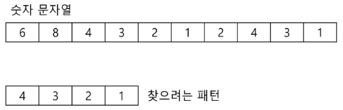
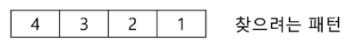
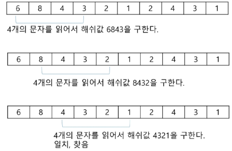
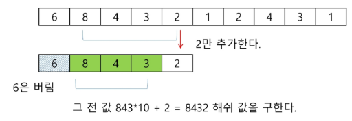

# 라빈-카프 알고리즘
- 문자열 검색을 위해 해시 값 함수를 사용
- 패턴 내의 문자들을 일일이 비교하는 대신에 패턴의 해시 값과 본문 안에 있는 하위 문자열의 해시 값만을 비교
- 최악의 시간 복잡도는 O(NXM)이지만 평균적으로는 선형에 가까운 빠른 속도를 가지는 알고리즘

# 코드는 라빈-카프.py 참고

# 라빈- 카프 알고리즘 동작 방식 - (1/4)
- 문자열 대신 숫자로 생각해보자
- 10개의 숫자 문자열이 주어지고 찾으려는 패턴은 "4321"이다.

# 라빈- 카프 알고리즘 동작 방식 - (2/4)
- 패턴의 해쉬값을 계산한다
    - 각 자리의 숫자에 자리값을 곱하여 더한다.
    - 즉 4*103 + 3*102 + 2*10+1 = 4321
    - 해쉬값은 "4321"라는 문자열이 아니라 정수값 4321이 된다

# 라빈- 카프 알고리즘 동작 방식 - (3/4)
- 찾고자 하는 문자열에서 4자리씩 해쉬값을 계산한다

# 라빈- 카프 알고리즘 동작 방식 - (4/4)
- 찾고자 하는 문자열에서 해쉬값을 구할 때
    - 찾고자 하는 문자열에서 한 글자씩 이동하며 패턴 길이만큼 읽어서 해쉬 값을 계산하는 것이 아니라
    - 새로 추가되는 문자와 그전에 읽었던 값을 이용하여 해쉬값을 구한다
    - 즉 아래 그림처럼 다음 해쉬값을 구할 때 그전의 해쉬값을 이용한다

# 라빈-카프 알고리즘 고려 사항
- 처음 해쉬 값을 구할 때는 찾고자 하는 문자열에서 패턴 길이만큼 읽어서 구한다
- 본 예제에서는 이해를 돕기 위해 패턴의 길이를 4자리 정수로 작게 했지만 패턴이 문자열이며 길이가 커지면 길이를
일정 자리수로 맞추기 위해 mod 연산을 취해준다
- 따라서 해쉬 값이 일치하더라도 실제 패턴이 일치하지 않을 수 있기 때문에 해쉬 값이 일치하면 문자열 일치를 검사해야한다. (이를 해쉬 충돌이라 한다)
