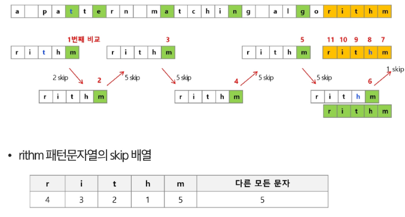

# 보이어-무어 알고리즘
- 문자열 검색을 위해 해시 값 함수를 사용
- 패턴 내의 문자들을 일일이 비교하는 대신에 패턴의 해시 값과 본문 안에 있는 하위 문자열의 해시 값만을 비교
- 최악의 시간 복잡도는 O(NXM)이지만 평균적으로는 선형에 가까운 빠른 속도를 가지는 알고리즘

# 오른쪽 끝에 있는 문자가 불일치하고, 이 문자가 패턴 내에 존재할 경우

# 보이어-무어 알고리즘 예

# 브루트포스, 라빈-카프 알고리즘은 텍스트 문자열의 문자를 적어도 한 번씩 비교함
- 최선 시간 복잡도 : Ω(n)

# 보이어-무어 알고리즘의 경우에는 텍스트 문자를 다 비교하지 않음
- 입력에 따라 다르지만 일반적으로 Θ(n)보다 시간이 덜 소요됨

# 발상의 전환 : 패턴의 오른쪽부터 비교