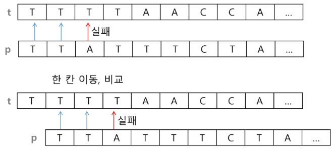
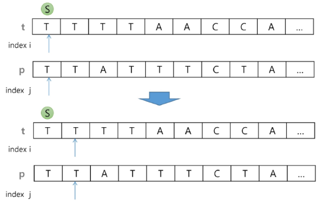
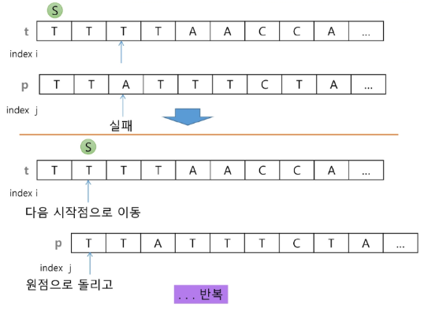

# 브루트포스(brute-force) 패턴 매칭 - (1/3)
- 본문 문자열을 처음부터 끝까지 차례대로 순회하면서 패턴 내의 문자들을 일일이 비교하는 방식으로 동작

# 브루트포스(brute-force) 패턴 매칭 - (2/3)

# 브루트포스(brute-force) 패턴 매칭 - (3/3)

# 브루트포스(brute-force) 패턴 매칭 코드 구현 : 
- O(N*M)
- 브루트포스.py 참고

# 브루트포스(brute-force) 패턴 매칭 알고리즘 시간 복잡도
- 최악의 경우 시간 복잡도는 텍스트의 모든 위치에서 패턴을 비교해야 하므로 O(NM)이 됨
- 예에서는 최악의 경우 약 10,000 * 80 = 800,000번의 비교가 일어난다.
- 비교횟수를 줄일 수 있는 방법? -> 아마 **라빈-카프** 알고리즘일듯
