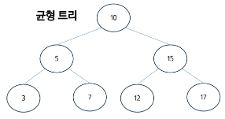
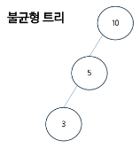
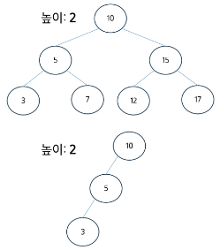
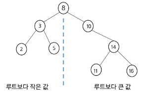
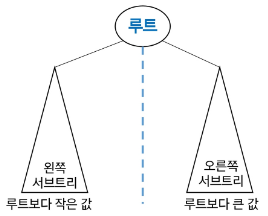

# BST( Binary Search Tree )
- 데이터의 저장, 검색, 삽입, 삭제를 효율적으로 처리하기 위한 자료 구조
- 특징
    - 각 노드가 최대 2개의 자식을 가짐
    - 데이터를 정렬된 형태로 저장하여 탐색/삽입/삭제를 효율적으로 수행
- 구조
    - 이진 트리의 특성을 가지지만 추가로 다음과 같은 속성을 가짐(순서속성)
        - 왼쪽 자식 노드의 키 값이 부모 노드의 키 값보다 작다
        - 오른쪽 자식 노드의 키 값이 부모 노드의 키 값보다 크다

# BST( Binary Search Tree ) 장점
- 배열이나 링크드 리스트와 달리, 삽입/삭제 후에도 데이터가 정렬된 상태를 유지
- 데이터가 균형 있게 분포되어 있을 때 평균적으로 탐색/삽입/삭제 연산의 시간복잡도가 O(logN)
- 동적으로 크기를 조정할 수 있어, 크기가 고정된 배열에 비해 유연성이 높음

# BST( Binary Search Tree ) 단점
- 트리가 한쪽으로 치우치면(즉, 균형이 맞지 않으면) 최악의 경우, 시간복잡도가 O(n)이 될 수 있음
- 각 노드는 두 개의 자식 포인터를 저장해야 하므로, 큰 데이터 집합의 경우 메모리 오버헤드가 발생할 수 있음

# BST( Binary Search Tree ) 속성
- 높이
    - 특정 노드에서 가장 깊은 리프 노드까지의 경로에 있는 간선의 개수
    - 트리의 높이는 루트 노드의 높이와 동일
    - 리프 노드의 높이는 0
    - 균형 잡힌 트리의 높이는 O(logN), 불균형한 트리의 높이는 O(N)
- 깊이
    - 루트 노드에서 해당 노드까지의 경로에 있는 간선의 수
    - 루트 노드의 높이는 0

--

# 정리
- BST는 탐색 작업을 효율적으로 하기 위한 자료구조이다.
    - 삽입/삭제/평균 : 평균 O(logN)
- 모든 원소는 서로 다른 유일한 키를 갖는다.
- key(왼쪽 서브트리) < key(루트 노드) < key(오른쪽 서브트리)
- 왼쪽 서브트리와 오른쪽 서브트리도 이진 탐색 트리다
- 중위 순회하면 오름차순으로 정렬된 값을 얻을 수 있다

# BST 문제 제시
- BST의 구조는 삽입되는 데이터의 순서에 따라 결정되기 때문에 특정 패턴으로 삽입되는 경우 불균형이 발생
    - 불균형한 BST의 문제점
    - 검색/삽입/삭제 연산의 시간복잡도가 O(N)이 됨 ( 균형 잡힌 BST의 경우 O(logN) )
    - 트리의 높이가 증가하게 되면서 많은 메모리 공간이 필요
    - 트리의 높이가 증가하게 되면서 깊이 있는 재귀호출로 인해서 스택 오버플로우 문제가 발생할 수 있음

- 불균형 문제를 해결할 수 있는 방법이 없을까?
    - 자가 균형 트리 (Self-Balancing Tree)
        - AVL 트리
        - 레드-블랙 트리