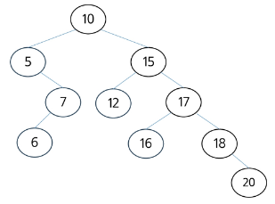
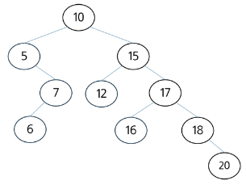
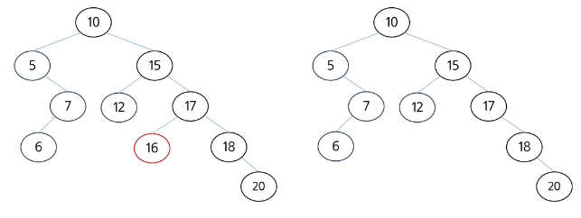
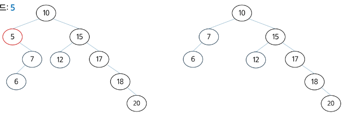
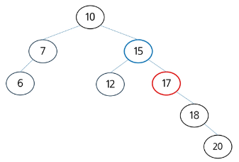
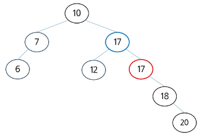
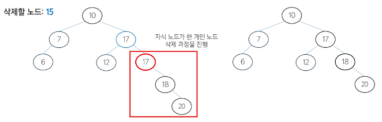

# BST 주요 연산 : 삭제 - (1/7)
- 삭제하려는 노드의 위치와 자식 노드의 유무에 따라 세 가지 경우로 나누어 처리
    - 삭제할 노드가 **리프**노드인 경우
    - 삭제할 노드가 **한 개의 자식 노드**를 가질 경우
    - 삭제할 노드가 **두 개의 자식 노드**를 가질 경우

# BST 주요 연산 : 삭제 - (2/7)
1. 루트 노드에서부터 삭제할 노드를 탐색하며, 탐색하는 과정은 탐색 연산과 동일하게 진행, -> 삭제할 노드 : 16

# BST 주요 연산 : 삭제 - (3/7)
2. 삭제할 노드(16)가 **리프 노드**인 경우, 단순히 제거하면 됨

# BST 주요 연산 : 삭제 - (4/7)
3. 삭제할 노드(5)가 **한 개의 자식을 가진 경우**, 삭제할 노드의 자식 노드를 부모 노드에 연결 -> 각 서브트리는 독립적으로 존재하여, BST 속성이 유지, -> 삭제할 노드 : 5

# BST 주요 연산 : 삭제 - (5/7)
4. 삭제할 노드(15)가 **두 개의 자식을 가진 경우**, 중위 후속자 또는 중위 전임자 찾기
    - **중위 후속자** : 삭제할 노드의 오른쪽 서브 트리에서 가장 작은 값 ( 일반적으로 사용 )
    - 중위 전임자 : 삭제할 노드의 왼쪽 서브 트리에서 가장 큰 값
    - BST 구조를 유지하기 위해서 **삭제할 노드와 가장 가까운 값**을 찾는 것

# BST 주요 연산 : 삭제 - (6/7)
5. 중위 후속자(17)의 값을 삭제할 노드(15)에 복사,  -> 삭제할 노드: 15

# BST 주요 연산 : 삭제 - (7/7)
6. 중위 후속자(17)를 삭제하고, 중위 후속자의 노드 상태에 따라 재귀적으로 반복 -> 중위 후속자는 무조건 리프 노드이거나 하나의 자식만을 가짐

# BST 주요 연산 - 삭제 코드
- 트리가 균형을 이루고 있을 때 : O(logN)
- 트리가 한 쪽으로 치우쳐 있을 때 : O(N)

# 삭제코드.py 참고