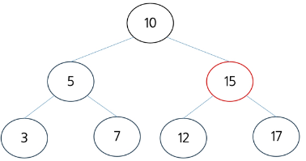

# BTS 주요 연산 : 삽입 - (1/4)
- 새로운 노드를 삽입할 때 BST의 특징(자식노드 최대 2개)를 유지하며, **삽입할 위치를 찾기 위해 루트 노드에서부터 적절한 위치까지 내려감**
- 트리의 순서 속성을 유지하기 위해서 새로운 노드는 리프 노드로 삽입

# BTS 주요 연산 : 삽입 - (2/4)
1. 루트 노드에서부터 삽입 위치를 탐색하며 현재 노드(10)과 삽입노드(16)를 비교, 10 < 16 이므로 오른쪽 자식으로 이동하여 삽입 위치를 탐색, -> 삽입 노드:16

# BTS 주요 연산 : 삽입 - (3/4)
2. 현재 노드(15)과 삽입 노드(16)를 비교, 15 < 16 이므로 오른쪽 자식으로 이동하여 삽입 위치를 탐색, -> 삽입 노드:16

# BTS 주요 연산 : 삽입 - (4/4)
3. 현재 노드(17)과 삽입 노드(16)를 비교, 17 > 16 이고 리프 노드이기 때문에 왼쪽 자식 노드로 삽입, -> 삽입 노드 : 16

# BST 주요 연산 - 삽입 코드
- 트리가 균형을 이루고 있을 때 : O(logN)
- 트리가 한 쪽으로 치우쳐 있을 때 : O(N)

# 삽입코드.py 참고