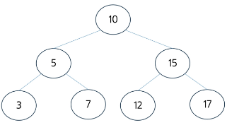
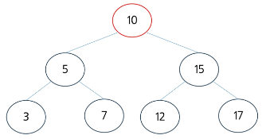
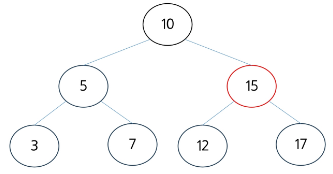
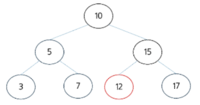

# BST 주요 연산: 탐색 - (1/4)
- **순서 속성**을 이용하여 루트 노드에서부터 시작하여 왼쪽 또는 오른쪽 자식으로 이동하면서 **키 값을 비교**하며 주어진 키 값을 찾는 과정

# BST 주요 연산: 탐색 - (2/4)
1. 루트 노드부터 탐색을 시작하며, 현재노드(10)과 찾고자하는 키(12)를 비교, 10 < 12 이므로 오른쪽 자식으로 이동하여 비교. 찾는 값: 12

# BST 주요 연산: 탐색 - (3/4)
2. 현재 노드(15)와 찾고자 하는 키(12)를 비교, 15 > 12 이므로 왼쪽 자식으로 이동하여 비교. 찾는 값: 12

# BST 주요 연산: 탐색 - (4/4)
3. 현재노드(12)와 찾고자 하는 키(12) 를 비교, 12 == 12 이므로 탐색을 종료

# BST 주요 연산 - 탐색 코드
- 트리가 균형을 이루고 있을 때 : O(logN)
- 트리가 한 쪽으로 치우쳐 있을 때 : O(N)

# 탐색코드.py 참고