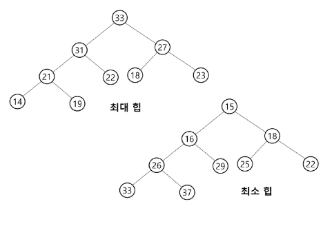
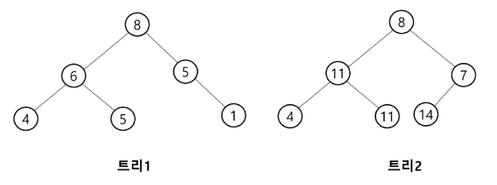

# 힙(heap)
- 완전 이진 트리에 있는 노드 중에서 키 값이 가장 큰 노드나 키 값이 가장 작은 노드를 찾기 위해서 만든 자료구조
- 최대 힙(max heap)
    - 키 값이 가장 큰 노드를 찾기 위한 **완전 이진 트리**
    - 부모 노드의 키 값 > 자식 노드의 키 값
    - 루트 노드 : 키 값이 가장 큰 노드
- 최소 힙(min heap)

# 힙(heap) 예시

# 힙(heap)이 아닌 이진 트리의 예

