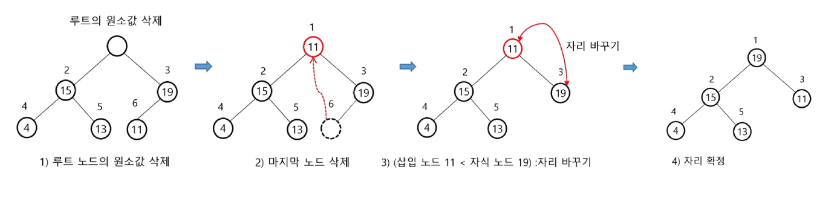

# 힙(heap) 에서는 루트 노드의 원소만을 삭제할 수 있음
# 힙(heap) 의 삭제 과정
- 루트 노드(최대값 또는 최소값)를 제거하고, 힙의 마지막 요소를 루트 위치로 이동한다.
- 새 루트를 자식 노드들과 비교하며, 힙 속성을 만족할 때까지 아래로 내린다

# 시간 복잡도
- 최선 : O(1)
- 평균/최악 : O(logN)

# 최대 힙에서의 삭제

# heap연산 - 삭제코드
- heap연산코드.py 참고 -> _siftdown 함수 , heappop 함수