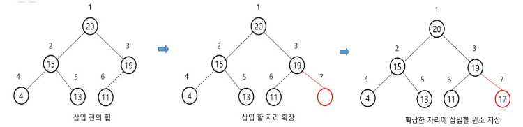
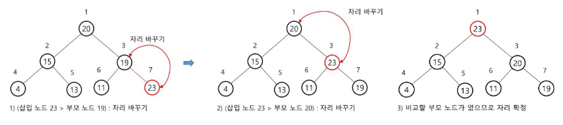

# 힙(heap)의 삽입 과정
- 새로운 원소를 heap의 마지막 위치(리스트의 끝)에 추가한다
- 새로 추가된 원소를 부모 노드와 비교하며, 힙 속성을 만족할 때까지 위로 올린다

# 시간 복잡도
- 최선 : O(1)
- 평균/최악 : O(logN)

# 최대 힙에서 17 삽입

# 최대 힙에서 23 삽입

# heap 연산의 삽입 코드
- heap연산코드.py 참고 -> _shiftup 함수 , heappush 함수