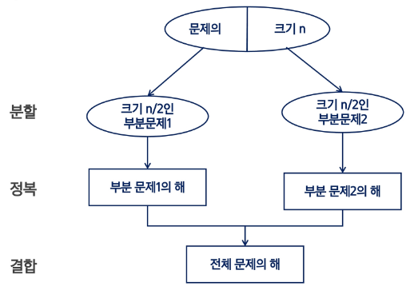
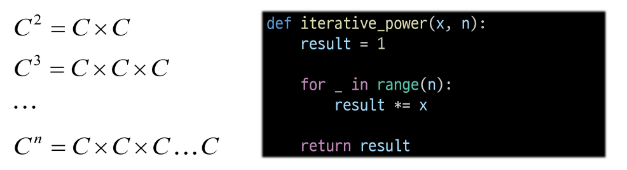
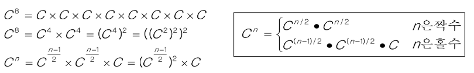

# Top-down approach 예시


# 거듭제곱
- 반복(Iterative) 알고리즘 : O(n)

```python
def iterative_power(x, n):
    result = 1
    for _ in range(n):
        result *= x
    
    return result
```

- 분할 정복 기반의 알고리즘 : O(log<sub>2</sub>n)

```python
def recursive_power(x,n):
    if n == 1:
        return x
    
    if n % 2 == 0 :
        y = recursive_power(x, n //2)
        return y * y
    
    else:
        y = recursive_power(x, (n - 1) // 2)
        return y * y * x
```