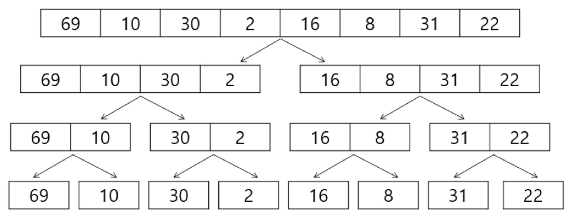
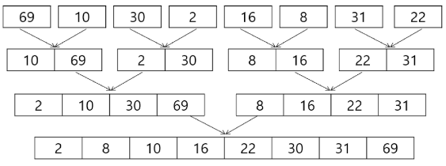

# 병합 정렬
- 여러 개의 정렬된 자료의 집합을 병합하여 한 개의 정렬된 집합으로 만드는 방식
- 분할 정복 알고리즘 활용
    - 자료를 최소 단위의 문제까지 나눈 후에 차례대로 정렬하여 최종 결과를 얻어냄
- 정렬 과정
1. 주어진 배열을 같은 크기의 두 부분의 배열로 나눈다 ( 재귀적으로 반복하여 더 이상 나눌 수 없을 때까지)
2. 나눠진 두 부분 배열을 하나의 정렬된 배열로 병합한다.
    1. 각 부분 배열의 첫 번째 원소부터 시작하여 더 작은 원소를 새 배열에 넣는다.
    2. 위 과정을 반복하여 모든 원소를 새 배열에 정렬된 상태로 병합한다
3. 위의 과정을 재귀적으로 적용하여 전체 배열이 정렬될 때까지 반복한다
- 시작복잡도 : O(nlogn)

# 병합 정렬 과정 - (1/2)
- {69, 10, 30, 2, 16, 8, 31, 22}를 병합 정렬하는 과정
- 분할 단계 : 전체 자료 집합에 대하여, 최소 크기의 부분집합이 될 때까지 분할 작업을 계속한다


# 병합 정렬 과정 - (2/2)
- 병합 단계 : 2개의 부분집합을 정렬하면서 하나의 집합으로 병합
- 8개의 부분집합이 1개로 병합될 때까지 반복함


# 병렬 정렬 구현 코드
- 나누는 파트
```python
def merge_sort(arr):
    n = len(arr)

    if n <= 1:
        return arr
    
    mid = n // 2
    left_half = arr[:mid]
    right_half = arr[mid:]

    left_half = merge_sort(left_half)
    right_half = merge_sort(right_half)

    return merge(left_half, right_half)
```

- 합치는 코드
```python
def merge(left, right):
    result = []

    while left and right:
        if left[0] < right[0]:
            result.append(left.pop(0))
        else:
            result.append(right.pop(0))
    
    result.extend(left)
    result.extend(right)

    return result
```

# 병합 정렬 정리
- 큰 데이터셋을 정렬할 때 유용하고, 안정적이고 예측 가능한 성능을 제공
- 최선/최악 시간복잡도 : O(nlogn)
- 안전성 : O
- 적응성 : X
- 제자리 정렬 : X