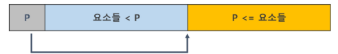
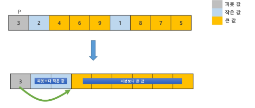
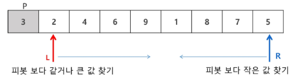
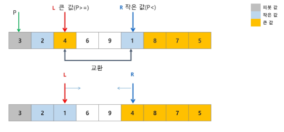
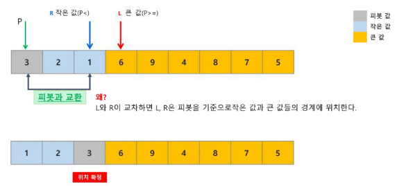
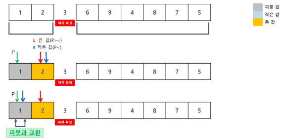
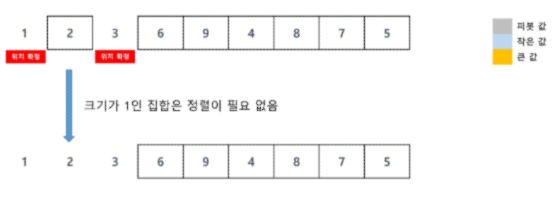
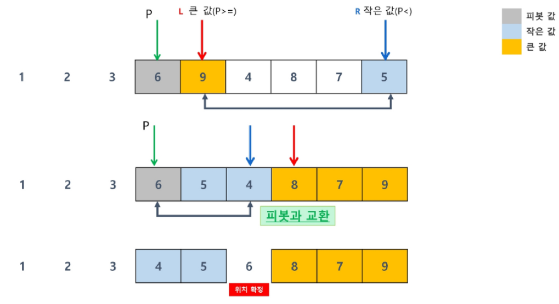
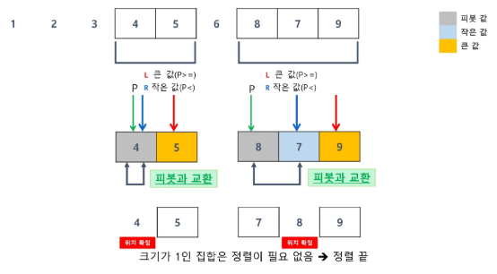

# 퀵 정렬
- 주어진 리스트를 두개로 분할하고, 각각을 정렬한다
- 퀵 정렬은 분할할 때, 기준 아이템(pivot item)을 중심으로 이보다 작은 것은 왼편, 같거나 큰 것은 오른편에 위치한다
- 정렬과정
    1. 리스트에서 하나의 요소를 피벗으로 선택한다
    2. 피벗보다 작은 요소들은 왼쪽으로, 큰 요소들은 오른쪽으로 이동시킨다
    3. 2번 과정을 통해 최종 위치에 놓인 피벗을 기준으로 왼쪽/오른쪽 부분 배열에 대해 각각 퀵 정렬을 재귀적으로 수행한다
    4. 부분 배열의 크기가 1 이하가 되면 재귀를 종료한다
- 시간 복잡도 : O(nlogn)

# 퀵 정렬 아이디어 - (1/2)
- P(피벗)값들보다 같거나 큰 값은 오른쪽, 작은 값들은 왼쪽 집합에 위치하도록 한다
- 피벗을 두 집합의 가운데에 위치시킨다



# 퀵 정렬 과정 - (1/7)
- 피벗 선택 : 가장 왼쪽 값


# 퀵 정렬 과정 - (2/7)


# 퀵 정렬 과정 - (3/7)


# 퀵 정렬 과정 - (4/7)


# 퀵 정렬 과정 - (5/7)


# 퀵 정렬 과정 - (6/7)


# 퀵 정렬 과정 - (7/7)


# 퀵 정렬 구현 코드
```python
def partition(arr, start, end):
    p = arr[start]
    left = start + 1
    right = end

    while True:
        while left <= end and arr[left] < p:
            left += 1
        while right > start and arr[right] >= p:
            right -= 1
        if left < right:
            arr[left], arr[right] = arr[right], arr[left]
        else:
            break
    
    arr[start], arr[right] = arr[right], arr[start]
    return right

def quick_sort(arr, start, end):
    if start < end:
        p = partition(arr, start, end)

        quick_sort(arr, start, p - 1)
        quick_sort(arr, p + 1, end)

arr = [38, 27, 43, 3, 9, 82, 10]
quick_sort(arr, 0, len(arr) - 1)
print(arr) # 출력 : [3, 9, 10, 27, 38, 43, 82]
```

# 퀵 정렬 정리
- 평균적으로 매우 빠르고, 메모리 효율이 좋음
- 최악 시간 복잡도 : O(n<sup>2<sup>)
- 최선 시간 복잡도 : O(nlogn)
- 안정성 : X
- 적응성 : O
- 제자리 정렬 : O