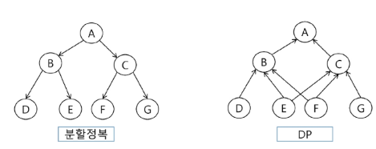
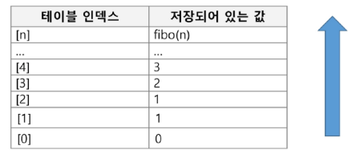

# DP(Dynamic Programming)
- 동적 계획(Dynamic Programming) 알고리즘은 그리디 알고리즘과 같이 최적화 문제를 해결하는 알고리즘이다
- 동적 계획 알고리즘은 먼저 입력 크기가 작은 부분 문제들을 모두 해결한 후에 그 해들을 이용하여 보다 큰 크기의 부분 문제들을 해결하여, 최종적으로 원래 주어진 입력의 문제를 해결하는 알고리즘

# 동적 계획법의 적용 요건 - (1/4)
- 동적 계획법을 적용하려는 문제는 필히 다음과 같은 요건을 가지고 있어야 한다
    - 중복 부분문제 구조(Overlapping subproblems)
    - 최적 부분문제 구조(Optimal substructure)

# 동적 계획법의 적용 요건 - (2/4)
- 중복 부분문제 구조(Overlapping subproblems)
    - DP는 큰 문제를 이루는 작은 문제들을 먼저 해결하고 작은 문제들의 최적 해(Optimal solution)를 이용하여 순환적으로 큰 문제를 해결
        - 순환적인 관계(recurrence relation)를 명시적으로 표현하기 위해서 동적 계획법에서는 일반적으로 수학적 도구인 **점화식**을 사용한다
    - DP는 문제의 순환적인 성질 때문에 이전에 계산되어졌던 작은 문제의 해가 다른 어딘가에서 필요하게 되는데(Overlapping subproblems) 이를 위해 DP 에서는 **이미 해결된 작은 문제들의 해들을 어떤 저장 공간(table)에 저장**하게 된다
    - 그리고 이렇게 저장된 해들이 다시 필요할 때 마다 해를 얻기 위해 다시 문제를 재계산하지 않고 table의 참조를 통해서 **중복된 계산을 피하게 된다**

# 동적 계획법의 적용 요건 - (3/4)
- 최적 부분문제 구조(Optimal substructure)
    - 동적 계획법이 최적화에 대한 어느 문제에나 적용될 수 있는 것은 아님. 문제가 최적화의 원칙을 만족해야만 효율적으로 적용 가능
    - 최적화의 원칙이란 **어떤 문제에 대한 해가 최적일 때 그 해를 구성하는 작은 문제들의 해 역시 최적**이어야 한다는 것

# 동적 계획법의 적용 요건 - (4/4)
- 최적의 원칙이 적용되지 않는 예: **최장경로(Longest Path) 문제**
    - A에서 D로의 최장 경로는 [A, C, B, D]가 된다
    - 그러나, 이 경로의 부분 경로인 A에서 C로의 최장 경로는 [A,C]가 아니라 [A,B,C]이다
    - 최적의 원칙이 적용되지 않는다
    - 따라서 최장경로문제는 DP로 해결할 수 없다

# 분할 정복과 동적 계획법의 비교 - (1/2)
- 분할 정복
    - 연관 없는 부분 문제로 분할한다
    - 부분문제를 재귀적으로 해결한다
    - 부분문제의 해를 결합(combine)한다
    - 예) 병합 정렬, 퀵 정렬
- DP
    - 부분 문제들이 연관이 없으면 적용할 수 없다. 즉 부분 문제들은 더 작은 부분 문제들을 공유한다
    - 모든 부분 문제를 한 번만 계산하고 결과를 저장하고 재사용한다

# 분할 정복과 동적 계획법의 비교 - (2/2)
- DP에는 부분 문제들 사이에 의존적 관계가 존재
    - 예를 들면 E,F,G의 해가 C를 해결하는데 사용되어지는 관계가 있다
- 이런 관계는 문제에 따라 다르고, 대부분의 경우 뚜렷이 보이지 않아서 함축적인 순서(implicit order)라고 함
- **분할 정복은 하향식 방법**으로 **DP는 상향식 방법**으로 접근


# 피보나치 수 DP 적용
- 피보나치 수는 부분 문제의 답으로부터 본 문제의 답을 얻을 수 있으므로 최적 부분 구조로 이루어져 있다
    1. 문제를 부분 문제로 분할한다
    2. 점화식으로 정의한다
    3. 가장 작은 부분 문제부터 해를 구한다. 그 결과는 테이블에 저장하고, 테이블에 저장된 부분 문제의 해를 이용하여 상위 문제의 해를 구함


# 피보나치 수 DP 코드 구현
```python
def fibo_dp(n):
    if n <= 1:
        return n
    
    dp = [0] * (n + 1)
    dp[1] = 1

    for i in range(2, n + 1):
        dp[i] = dp[i - 1] + dp[i - 2]
    
    return dp[n]

print(fibo_dp(10))  # 출력 : 55
```

# 피보나치 DP 정리
- 피보나치 수 구하기 - DP 알고리즘 분석
    - DP 알고리즘이 수행속도가 더 빠르다
    - 이유
        - 재귀 알고리즘과는 달리 중복 계산이 없다
        - 또한 반복문을 사용하기 때문에 함수 호출이 발생하지 않는다
- 계산하는 항(fibo_dp[n])의 총 개수
    - T(n) = n+1
    - 즉, fibo_dp[0]부터 fibo_dp[n]까지 단 한번씩만 계산한다