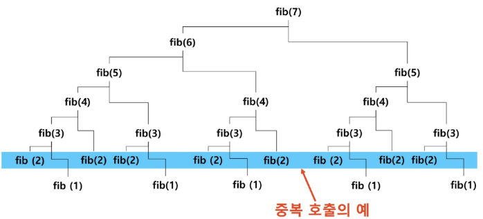

# 피보나치 수열
- 이전의 두 수 합을 항으로 하는 수열을 피보나치라고 한다
    - 0, 1, 1, 2, 3, 5, 8, 13, ...
- 피보나치 수열의 i번째 값을 계산하는 함수 F를 정의하면 다음과 같다.
    - F<sub>0</sub> = 0, F<sub>1</sub> = 1
    - F<sub>i</sub> = F<sub>i-1</sub>+F<sub>i-2</sub> for i >= 2
- 위의 정의로부터 피보나치 수열의 i번째 항을 반환하는 함수를 재귀함수로 구현할 수 있다
# 피보나치 수를 구하는 재귀 함수
```python
def fibo(n):
    if n < 2:
        return n
    else:
        return fibo(n-1) + fibo(n-2)
```

# 피보나치 수를 구하는 재귀 함수의 문제점
- 엄청난 중복 호출이 존재
